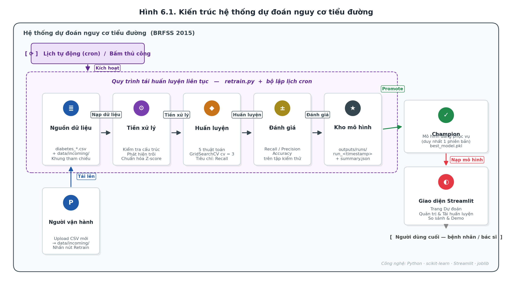
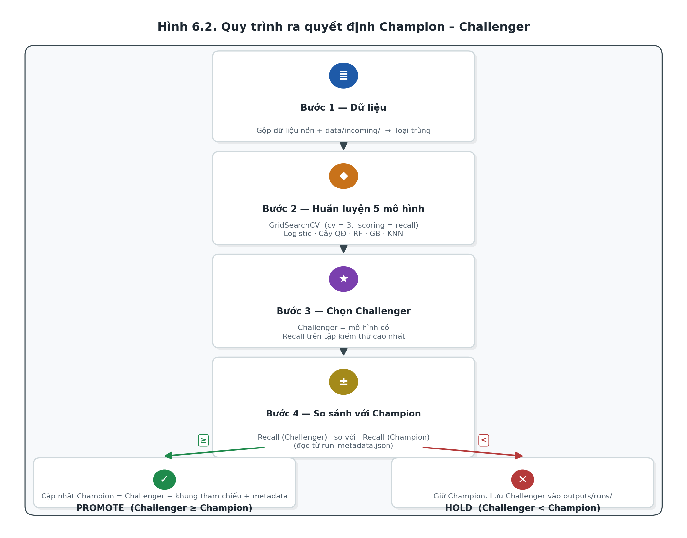
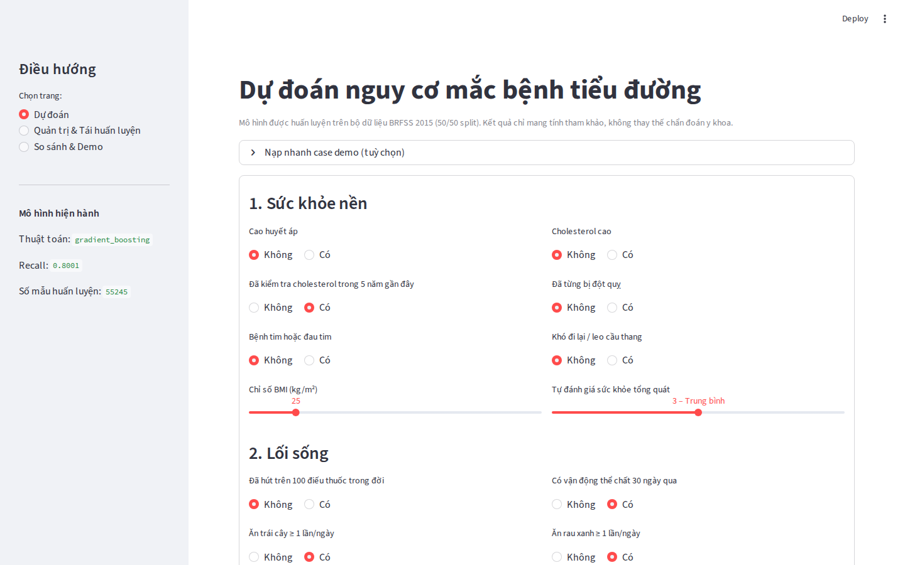
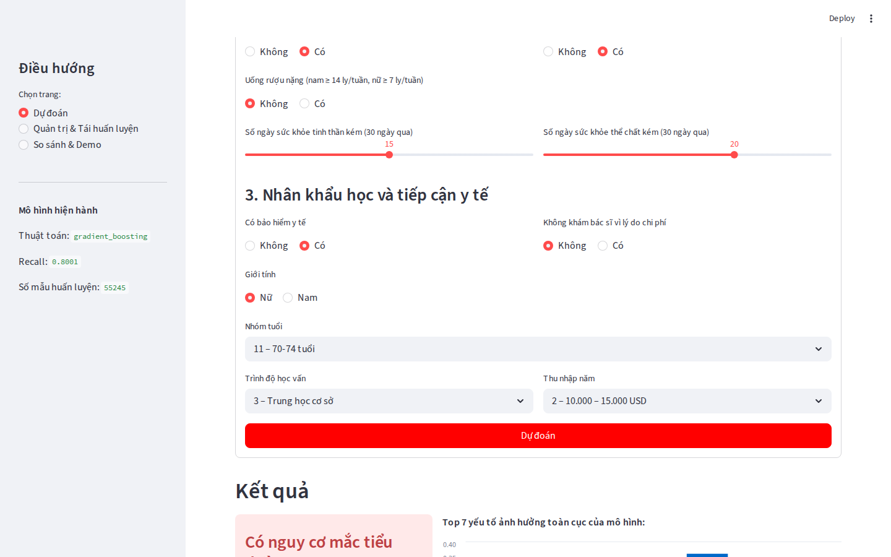
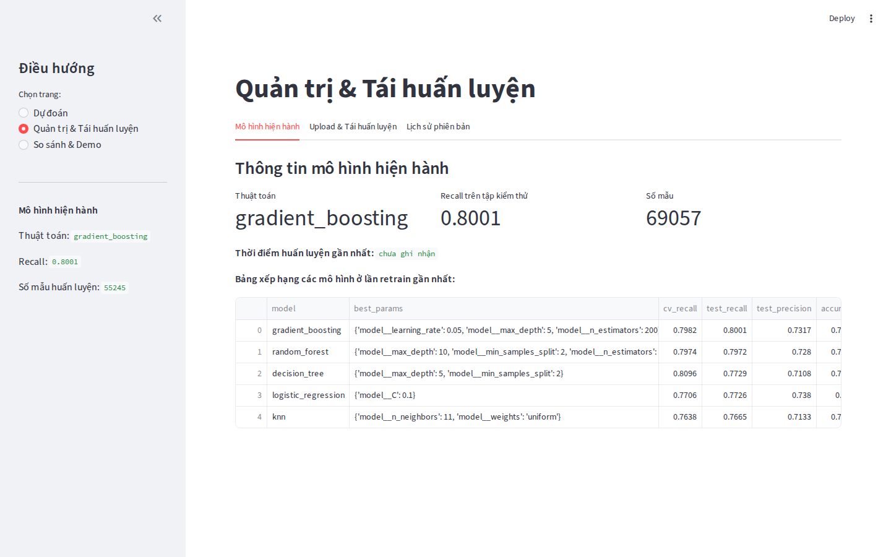
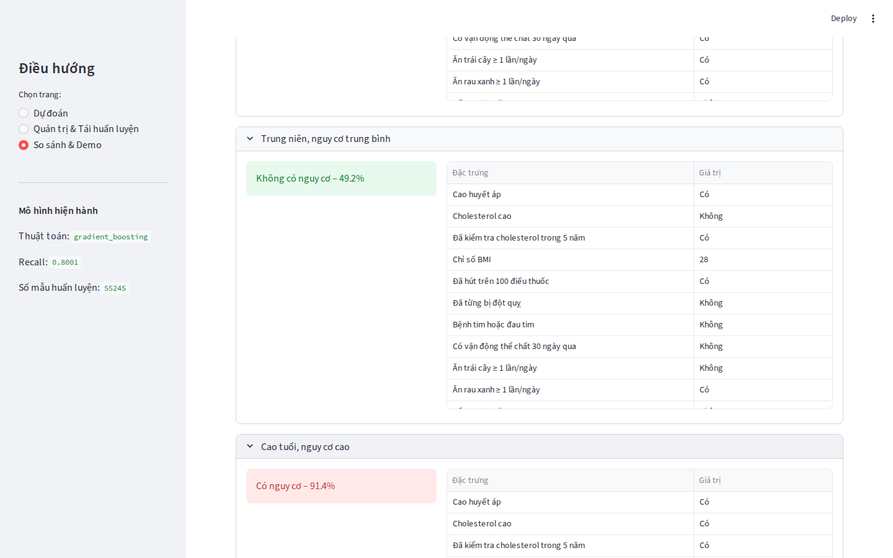

**CHƯƠNG 1: TỔNG QUAN VÀ HÌNH THÀNH BÀI TOÁN**

**1.1. Lý do chọn đề tài**

Bệnh tiểu đường hiện nay là một trong những bệnh mãn tính phổ biến và có tốc độ gia tăng nhanh trên toàn thế giới. Đây là căn bệnh nguy hiểm do thường tiến triển âm thầm trong thời gian dài và khó được phát hiện ở giai đoạn sớm. Nếu không được chẩn đoán và điều trị kịp thời, bệnh có thể dẫn đến nhiều biến chứng nghiêm trọng như tim mạch, đột quỵ, suy thận, tổn thương thần kinh và giảm chất lượng cuộc sống của người bệnh. Vì vậy, việc phát hiện sớm nguy cơ mắc bệnh tiểu đường có ý nghĩa đặc biệt quan trọng trong công tác chăm sóc và bảo vệ sức khỏe cộng đồng.

Trong bối cảnh hiện nay, cùng với sự phát triển của công nghệ thông tin và hệ thống lưu trữ dữ liệu, lượng dữ liệu y tế được thu thập ngày càng lớn và đa dạng. Các dữ liệu này chứa nhiều thông tin giá trị liên quan đến tình trạng sức khỏe, thói quen sinh hoạt và các yếu tố nguy cơ của bệnh nhân. Điều này tạo điều kiện thuận lợi cho việc áp dụng các kỹ thuật khai phá dữ liệu (Data Mining) và học máy (Machine Learning) nhằm phân tích dữ liệu và hỗ trợ dự đoán bệnh. So với các phương pháp thống kê truyền thống, các mô hình học máy có khả năng phát hiện các mẫu dữ liệu tiềm ẩn, học được mối quan hệ phức tạp giữa các đặc trưng và đưa ra dự đoán với độ chính xác cao hơn.

Bên cạnh giá trị học thuật, bài toán dự đoán nguy cơ mắc bệnh tiểu đường còn có tính ứng dụng thực tiễn cao. Hệ thống dự đoán có thể được sử dụng như một công cụ hỗ trợ ra quyết định trong lĩnh vực y tế, giúp bác sĩ và người dùng đánh giá sớm nguy cơ mắc bệnh dựa trên các chỉ số sức khỏe. Ngoài ra, việc xây dựng hệ thống mining kết hợp cơ chế cập nhật và tái huấn luyện mô hình định kỳ còn giúp hệ thống có khả năng thích nghi với dữ liệu mới, nâng cao tính ổn định và khả năng triển khai thực tế.

Trong đề tài này, nhóm sử dụng bộ dữ liệu BRFSS (Behavioral Risk Factor Surveillance System) năm 2015 về các chỉ số sức khỏe liên quan đến bệnh tiểu đường. Đây là bộ dữ liệu thực tế có kích thước lớn, được thu thập từ khảo sát sức khỏe cộng đồng, bao gồm nhiều thuộc tính phản ánh tình trạng sức khỏe và hành vi sinh hoạt của người dân. Với quy mô dữ liệu lớn, tính đa dạng và độ tin cậy cao, bộ dữ liệu BRFSS phù hợp để nghiên cứu, xây dựng và đánh giá các mô hình học máy trong bài toán dự đoán nguy cơ mắc bệnh tiểu đường.

Từ những lý do trên, nhóm quyết định lựa chọn đề tài “Xây dựng hệ thống phân loại dự đoán nguy cơ mắc bệnh tiểu đường và triển khai quy trình huấn luyện liên tục” nhằm nghiên cứu và ứng dụng các kỹ thuật khai phá dữ liệu, học máy vào lĩnh vực chăm sóc sức khỏe, đồng thời xây dựng nền tảng cho các hệ thống hỗ trợ chẩn đoán thông minh trong tương lai.

**1.2. Phát biểu bài toán**

Trong bối cảnh số lượng người mắc bệnh tiểu đường ngày càng gia tăng, nhu cầu xây dựng các hệ thống hỗ trợ dự đoán nguy cơ mắc bệnh dựa trên dữ liệu sức khỏe ngày càng trở nên cần thiết. Với sự phát triển của khai phá dữ liệu và học máy, các mô hình dự đoán có khả năng hỗ trợ phát hiện sớm nguy cơ mắc bệnh thông qua việc phân tích các đặc trưng liên quan đến tình trạng sức khỏe và lối sống của người dùng.

Trong đề tài này, dữ liệu đầu vào bao gồm các đặc trưng sức khỏe và hành vi sinh hoạt được thu thập từ bộ dữ liệu BRFSS 2015, chẳng hạn như chỉ số khối cơ thể (BMI), huyết áp cao (HighBP), cholesterol cao (HighChol), mức độ hoạt động thể chất (PhysActivity), độ tuổi (Age), tình trạng sức khỏe tổng quát (GenHlth), thu nhập (Income), trình độ học vấn (Education) cùng nhiều thuộc tính khác có liên quan đến nguy cơ mắc bệnh tiểu đường.

Biến mục tiêu của bài toán là thuộc tính Diabetes\_binary, trong đó:

- Giá trị 0 biểu thị người không mắc bệnh tiểu đường.

- Giá trị 1 biểu thị người mắc bệnh tiểu đường.

Dựa trên đặc điểm của bộ dữ liệu và yêu cầu của bài toán, đề tài được xác định thuộc bài toán phân loại nhị phân (Binary Classification) trong lĩnh vực học máy có giám sát (Supervised Learning). Mô hình học máy được huấn luyện trên tập dữ liệu đã có nhãn nhằm học các đặc trưng và mối quan hệ giữa các yếu tố sức khỏe với tình trạng mắc bệnh tiểu đường.

Thông qua quá trình huấn luyện, mô hình có khả năng phân loại một đối tượng vào một trong hai nhóm: mắc bệnh hoặc không mắc bệnh tiểu đường dựa trên các chỉ số sức khỏe và hành vi sinh hoạt đầu vào. Kết quả dự đoán của mô hình được sử dụng để hỗ trợ đánh giá nguy cơ mắc bệnh, góp phần hỗ trợ quá trình sàng lọc và phát hiện sớm bệnh tiểu đường.

**1.3. Mục tiêu xây dựng hệ thống**

Đề tài hướng đến việc xây dựng một hệ thống hỗ trợ dự đoán nguy cơ mắc bệnh tiểu đường dựa trên các kỹ thuật khai phá dữ liệu và học máy. Hệ thống được thiết kế nhằm đáp ứng cả mục tiêu chức năng, mục tiêu kỹ thuật và mục tiêu nghiên cứu học thuật.

*1.3.1. Mục tiêu chức năng*

Đề tài hướng đến xây dựng một hệ thống hỗ trợ dự đoán nguy cơ mắc bệnh tiểu đường dựa trên các kỹ thuật khai phá dữ liệu và học máy. Hệ thống cần có khả năng thực hiện toàn bộ quy trình xử lý dữ liệu từ giai đoạn phân tích, tiền xử lý đến huấn luyện và đánh giá mô hình một cách tự động và có hệ thống.

Trước hết, hệ thống phải hỗ trợ phân tích và khám phá dữ liệu sức khỏe từ bộ dữ liệu đầu vào nhằm xác định các đặc trưng quan trọng có ảnh hưởng đến nguy cơ mắc bệnh tiểu đường. Quá trình này bao gồm việc thống kê mô tả dữ liệu, phân tích phân phối và trực quan hóa dữ liệu để hỗ trợ hiểu rõ đặc điểm của tập dữ liệu nghiên cứu.

Bên cạnh đó, hệ thống cần thực hiện các bước tiền xử lý dữ liệu như làm sạch dữ liệu, chuyển đổi kiểu dữ liệu và chuẩn hóa dữ liệu nhằm đảm bảo chất lượng dữ liệu đầu vào phục vụ cho quá trình huấn luyện mô hình học máy. Việc xây dựng pipeline tiền xử lý giúp đảm bảo tính nhất quán và khả năng tái sử dụng trong các lần huấn luyện tiếp theo.

Ngoài chức năng xử lý dữ liệu, hệ thống cần hỗ trợ huấn luyện nhiều mô hình học máy khác nhau phục vụ bài toán phân loại nhị phân. Sau quá trình huấn luyện, hệ thống thực hiện đánh giá và so sánh hiệu năng giữa các mô hình dựa trên các chỉ số đánh giá phù hợp nhằm lựa chọn mô hình tối ưu cho bài toán dự đoán nguy cơ mắc bệnh tiểu đường.

Hệ thống đồng thời cần có khả năng tự động lưu trữ mô hình, kết quả thực nghiệm và metadata của quá trình huấn luyện để phục vụ việc tái sử dụng và quản lý mô hình. Ngoài ra, đề tài còn hướng đến xây dựng cơ chế hỗ trợ cập nhật dữ liệu và tái huấn luyện mô hình định kỳ nhằm đảm bảo khả năng thích nghi của hệ thống khi có dữ liệu mới phát sinh trong thực tế.

*1.3.2. Mục tiêu kỹ thuật*

Bên cạnh mục tiêu chức năng, đề tài còn hướng đến việc xây dựng hệ thống đáp ứng các yêu cầu kỹ thuật liên quan đến hiệu năng xử lý, khả năng mở rộng và tự động hóa quy trình khai phá dữ liệu.

Hệ thống cần có khả năng xử lý hiệu quả bộ dữ liệu BRFSS với quy mô hơn 70.000 mẫu dữ liệu và nhiều thuộc tính sức khỏe khác nhau. Quá trình xử lý và huấn luyện mô hình phải đảm bảo tính ổn định, đồng thời tối ưu thời gian thực thi và khả năng sử dụng tài nguyên tính toán.

Một mục tiêu quan trọng khác là tự động hóa toàn bộ pipeline từ bước đọc dữ liệu, tiền xử lý, huấn luyện, đánh giá mô hình đến lưu trữ kết quả thực nghiệm. Việc tự động hóa giúp giảm sự can thiệp thủ công, tăng khả năng tái lập thực nghiệm và hỗ trợ mở rộng hệ thống trong tương lai.

Ngoài ra, hệ thống cần hỗ trợ khả năng cập nhật dữ liệu mới và tái huấn luyện mô hình mà không cần xây dựng lại toàn bộ quy trình xử lý. Các mô hình sau khi huấn luyện phải được lưu trữ dưới dạng có thể tái sử dụng trong các lần dự đoán tiếp theo hoặc triển khai thực tế.

Đề tài cũng hướng đến việc sinh tự động các báo cáo đánh giá mô hình, lưu trữ kết quả thực nghiệm và metadata nhằm phục vụ cho quá trình phân tích, so sánh và quản lý kết quả nghiên cứu.

*1.3.3. Mục tiêu học thuật*

Về mặt học thuật, đề tài tập trung nghiên cứu và so sánh hiệu quả của nhiều thuật toán học máy khác nhau trong bài toán dự đoán nguy cơ mắc bệnh tiểu đường. Các mô hình được lựa chọn bao gồm Logistic Regression, Decision Tree, Random Forest, Gradient Boosting và K-Nearest Neighbors (KNN). Đây là các thuật toán phổ biến trong lĩnh vực khai phá dữ liệu và phân loại dữ liệu y tế.

Thông qua quá trình thực nghiệm, đề tài tiến hành đánh giá khả năng dự đoán của từng mô hình trên cùng một tập dữ liệu nhằm xác định mô hình phù hợp nhất cho bài toán nghiên cứu. Việc so sánh được thực hiện dựa trên nhiều chỉ số đánh giá khác nhau như Accuracy, Precision, Recall, F1-score, ROC-AUC và Confusion Matrix nhằm đảm bảo đánh giá toàn diện hiệu năng mô hình.

Bên cạnh việc đánh giá độ chính xác, đề tài còn tập trung phân tích mức độ ảnh hưởng của các đặc trưng đầu vào thông qua phương pháp Feature Importance. Kết quả phân tích giúp xác định các yếu tố sức khỏe có ảnh hưởng lớn đến nguy cơ mắc bệnh tiểu đường, từ đó hỗ trợ quá trình giải thích mô hình và nâng cao giá trị ứng dụng thực tiễn của hệ thống.	

Ngoài ra, đề tài cũng phân tích ưu điểm, hạn chế và khả năng ứng dụng của từng thuật toán trong bối cảnh dữ liệu y tế nhằm làm cơ sở cho việc lựa chọn mô hình phù hợp trong các hệ thống hỗ trợ dự đoán bệnh lý trong tương lai.

**1.4. Phạm vi nghiên cứu**

Để đảm bảo tính tập trung, khả năng triển khai và phù hợp với phạm vi của đề tài môn Khai phá dữ liệu, nhóm xác định phạm vi nghiên cứu bao gồm các nội dung sau.

*1.4.1. Phạm vi dữ liệu*

Đề tài sử dụng bộ dữ liệu BRFSS 2015 Diabetes Health Indicators làm nguồn dữ liệu chính cho quá trình nghiên cứu, phân tích và thực nghiệm. Đây là bộ dữ liệu khảo sát sức khỏe cộng đồng có quy mô lớn, bao gồm nhiều thuộc tính liên quan đến tình trạng sức khỏe, thói quen sinh hoạt và nguy cơ mắc bệnh tiểu đường của người tham gia khảo sát.

Các thuộc tính được sử dụng trong nghiên cứu bao gồm các chỉ số như huyết áp cao (HighBP), cholesterol cao (HighChol), chỉ số BMI, hoạt động thể chất (PhysActivity), sức khỏe tổng quát (GenHlth), độ tuổi (Age), thu nhập (Income), trình độ học vấn (Education) cùng nhiều đặc trưng khác có liên quan đến nguy cơ mắc bệnh tiểu đường.

Bộ dữ liệu sau khi xử lý gồm khoảng 70.000 mẫu dữ liệu và được sử dụng cho các bước phân tích khám phá dữ liệu, tiền xử lý, huấn luyện và đánh giá mô hình học máy.

*1.4.2. Phạm vi mô hình*

Đề tài tập trung nghiên cứu các thuật toán học máy có giám sát (Supervised Learning) phục vụ bài toán phân loại nhị phân trong lĩnh vực dự đoán nguy cơ mắc bệnh tiểu đường. Các mô hình được lựa chọn bao gồm:

- Logistic Regression

- Decision Tree

- Random Forest

- Gradient Boosting

- K-Nearest Neighbors (KNN)

Các mô hình trên được sử dụng nhằm đánh giá khả năng học dữ liệu, so sánh hiệu năng và lựa chọn thuật toán phù hợp nhất cho bài toán dự đoán bệnh tiểu đường.

Trong phạm vi nghiên cứu của đề tài, nhóm không triển khai các phương pháp học sâu (Deep Learning) hoặc các mô hình trí tuệ nhân tạo phức tạp khác do yêu cầu tài nguyên tính toán lớn, thời gian huấn luyện cao và chưa thực sự cần thiết đối với cấu trúc của bộ dữ liệu hiện tại.

*1.4.3. Phạm vi hệ thống*

Hệ thống được xây dựng theo hướng hỗ trợ khai phá dữ liệu và huấn luyện mô hình học máy trên môi trường offline. Quy trình xử lý dữ liệu và huấn luyện mô hình được thực hiện theo cơ chế batch-based, tức dữ liệu được xử lý theo từng đợt thay vì xử lý liên tục theo thời gian thực.

Đề tài tập trung xây dựng pipeline gồm các bước: đọc dữ liệu, tiền xử lý, huấn luyện mô hình, đánh giá kết quả, lưu trữ mô hình và hỗ trợ tái huấn luyện khi có dữ liệu mới. Ngoài ra, hệ thống còn hỗ trợ sinh báo cáo kết quả và lưu metadata phục vụ cho việc quản lý thực nghiệm.

Trong phạm vi hiện tại, hệ thống chưa triển khai trên môi trường production hoặc nền tảng điện toán đám mây (cloud), đồng thời chưa tích hợp cơ chế xử lý dữ liệu thời gian thực (real-time processing).

*1.4.4. Giới hạn của đề tài*

Mặc dù đạt được khả năng dự đoán nguy cơ mắc bệnh tiểu đường dựa trên dữ liệu sức khỏe, hệ thống được xây dựng trong đề tài chỉ mang tính chất hỗ trợ tham khảo và nghiên cứu học thuật. Kết quả dự đoán của mô hình không có giá trị thay thế bác sĩ, chuyên gia y tế hoặc các phương pháp chẩn đoán lâm sàng chuyên sâu.

Độ chính xác của mô hình phụ thuộc vào chất lượng dữ liệu đầu vào, phạm vi đặc trưng được sử dụng cũng như tính đại diện của bộ dữ liệu nghiên cứu. Ngoài ra, dữ liệu BRFSS chủ yếu dựa trên khảo sát cộng đồng nên vẫn có khả năng tồn tại sai số chủ quan từ người tham gia khảo sát.

Bên cạnh đó, hệ thống hiện mới tập trung vào bài toán phân loại nguy cơ mắc bệnh tiểu đường mà chưa mở rộng sang các bài toán dự đoán biến chứng, phân loại mức độ bệnh hoặc hỗ trợ điều trị cá nhân hóa. Đây sẽ là những hướng phát triển tiềm năng trong tương lai.

**CHƯƠNG 2: CƠ SỞ LÝ THUYẾT VÀ CẤU TRÚC MÔ HÌNH**

**2.1. Tổng quan về khai quá dữ liệu và bài toán phân loại**

***2.1.1. Khái niệm về khai phá dữ liệu***

1. *Định nghĩa và bản chất*

Khai phá dữ liệu là bước cốt lõi trong toàn bộ quy trình Khám phá tri thức từ cơ sở dữ liệu (Knowledge Discovery in Databases \- KDD). Bản chất của khai phá dữ liệu không đơn thuần là việc trích xuất hay tìm kiếm dữ liệu thông thường, mà là quá trình phân tích một lượng lớn dữ liệu thô để tự động (hoặc bán tự động) phát hiện ra các mẫu, các xu hướng, các quy luật ẩn và các mối liên hệ có ý nghĩa thống kê mà con người khó có thể nhận biết bằng các phương pháp thủ công. Về mặt kỹ thuật, khai phá dữ liệu là sự giao thoa của ba lĩnh vực khoa học chính:

- Thống kê: Cung cấp nền tảng toán học để phân tích định lượng, kiểm định giả thuyết và mô tả tính chất của dữ liệu.  
- Học máy: Cung cấp các thuật toán để hệ thống có khả năng tự học hỏi, tối ưu hóa từ dữ liệu và đưa ra các dự đoán hoặc phân loại (như Logistic Regression, Random Forest, v.v.).  
- Hệ quản trị cơ sở dữ liệu: Cung cấp các công cụ và kỹ thuật để lưu trữ, truy xuất, thao tác và quản lý dữ liệu lớn một cách hiệu quả trong kiến trúc Data Warehouse hoặc Data Lake.  
2. Vai trò của khai phá dữ liệu trong y tế và chăm sóc sức khỏe

Trong lĩnh vực y tế, dữ liệu được sinh ra liên tục với khối lượng khổng lồ và độ phức tạp cao từ nhiều nguồn khác nhau: hồ sơ bệnh án điện tử (EHR), kết quả xét nghiệm lâm sàng, thiết bị theo dõi sức khỏe IoT, và đặc biệt là các hệ thống giám sát y tế cộng đồng quy mô lớn như bộ dữ liệu BRFSS (Behavioral Risk Factor Surveillance System) của CDC.

Nếu không có sự can thiệp của các kỹ thuật khai phá dữ liệu, những khối dữ liệu này chỉ là những con số và thông tin rời rạc, tồn tại trạng thái "nhiều dữ liệu nhưng khát tri thức". Khai phá dữ liệu giải quyết bài toán này thông qua việc:

- Phát hiện các yếu tố nguy cơ: Tìm ra mối tương quan ẩn giữa thói quen sinh hoạt (hút thuốc, mức độ vận động), chỉ số thể chất (BMI, huyết áp) với sự phát triển của bệnh lý. Ví dụ: Mô hình có thể phát hiện quy luật rằng một cá nhân trên 50 tuổi, có BMI vượt ngưỡng 30 và ít vận động sẽ có nguy cơ mắc tiểu đường cao gấp nhiều lần so với nhóm khác.  
- Phân nhóm bệnh nhân: Phân chia tập cộng đồng thành các nhóm rủi ro khác nhau (Cao, Trung bình, Thấp) để có chiến lược can thiệp phù hợp.  
- Hỗ trợ ra quyết định lâm sàng và dự phòng: Chuyển đổi kết quả phân tích thành các thông tin cảnh báo sớm có thể hành động được.  
3. Ứng dụng cụ thể vào bài toán của đề tài

Đối với đề tài phân loại nguy cơ mắc bệnh tiểu đường, khai phá dữ liệu đóng vai trò là "bộ lọc" thông minh. Thay vì xử lý các chẩn đoán đắt đỏ và tốn thời gian tại bệnh viện, quy trình khai phá dữ liệu tận dụng bộ dữ liệu khảo sát cộng đồng để xây dựng mô hình dự đoán. Nhờ đó, hệ thống y tế có thể sàng lọc sớm trên diện rộng, tối ưu hóa chi phí y tế và giúp người dân thay đổi hành vi trước khi bệnh tiến triển sang các giai đoạn biến chứng nguy hiểm.

***2.1.2. Bài toán phân loại***

Phân loại là một trong những bài toán cốt lõi của Học có giám sát. Nhiệm vụ của hệ thống là tự động học các đặc trưng từ một tập dữ liệu đã được gán nhãn từ trước, sau đó xây dựng một mô hình có khả năng dự đoán nhãn cho các điểm dữ liệu mới.

1. Bản chất toán học và quá trình xấp xỉ hàm mục tiêu

Về mặt toán học định hình, bài toán phân loại được đặt trong một không gian đặc trưng d chiều. Giả sử ta có một tập dữ liệu huấn luyện D=x1, y1, x2, y2, . . . , xN, yN, trong đó:

- xi= xi1, xi2, . . . , xidT Rd là vector đặc trưng đại diện cho bệnh nhân thứ i. Trong tập dữ liệu BRFSS, d là số lượng các biến số y tế (như độ tuổi, chỉ số BMI, huyết áp, thói quen hút thuốc,...).  
- yi Y là nhãn phân lớp thực tế của bệnh nhân đó. Vì đề tài giải quyết bài toán phân loại nhị phân, không gian nhãn chỉ gồm hai giá trị: Y=0,1.  
  - Lớp 0 (Negative Class): Biểu thị người khảo sát không mắc bệnh tiểu đường  
  - Lớp 1 (Positive Class): Biểu thị người khảo sát có nguy cơ hoặc đã mắc bệnh tiểu đường.

Quá trình học máy thực chất là quá trình đi tìm một tập tham số  để tối ưu hóa một hàm mục tiêu fx,. Mục đích là xấp xỉ hàm xác suất có điều kiện PY=1|X, – tức là xác suất một người rơi vào Lớp 1 khi biết trước các chỉ số sức khỏe X của họ.

2. Ranh giới quyết định trong không gian n-chiều

Khi mô hình tiến hành phân loại, nó đang cố gắng phân chia không gian đặc trưng Rd thành các khu vực riêng biệt đại diện cho từng lớp. Đường hoặc mặt phẳng phân chia các khu vực này được gọi là Ranh giới quyết định. 

Với mô hình baseline là Hồi quy Logistic, ranh giới này là một siêu mặt phẳng (hyperplane) tuyến tính, định nghĩa bởi phương trình Tx=0. Nó phù hợp nếu dữ liệu có tính phân tách tuyến tính.

Với các mô hình nâng cao như Decision Tree hay Random Forest, ranh giới quyết định là tập hợp của nhiều mặt phẳng trực giao song song với các trục tọa độ, tạo ra các vùng phân phối phi tuyến tính, giúp nắm bắt được các mối quan hệ phức tạp (ví dụ: sự kết hợp đồng thời giữa "Tuổi \> 50" và "BMI \> 30" đẩy rủi ro lên rất cao).

3. Ngưỡng phân loại và ứng dụng trong y tế

Đầu ra thô của các mô hình phân loại nhị phân (đặc biệt là Logistic Regression hay Gradient Boosting) thường không phải là nhãn 0 hay 1 trực tiếp, mà là một giá trị dự đoán p0,1 biểu thị xác suất mắc bệnh.

Để đưa ra quyết định cuối cùng, hệ thống cần áp dụng một ngưỡng phân loại  (Threshold), với quy tắc:

- Dự đoán y=1 nếu p  
- Dự đoán y=0 nếu p\<

Trong các bài toán thông thường,  mặc định được đặt ở mức 0.5. Tuy nhiên, trong lĩnh vực y tế dự phòng, ngưỡng này thường được tinh chỉnh giảm xuống (ví dụ: 0.3 hoặc 0.4) nhằm chủ động cảnh báo sớm, chấp nhận việc dự đoán nhầm người khỏe thành bệnh (tăng Độ chính xác dương tính giả) để đổi lấy việc không bỏ sót bất kỳ ai thực sự có rủi ro.

**2.2. Các mô hình học máy sử dụng**

***2.2.1. Mô hình cơ sở: Hồi quy Logistic (Logistic Regression)***

1. Cơ sở toán học

Mặc dù mang tên "Hồi quy", Logistic Regression là một thuật toán phân loại tuyến tính. Mô hình này không dự đoán trực tiếp nhãn phân lớp mà tính toán xác suất xảy ra của một sự kiện (trong trường hợp này là rủi ro mắc tiểu đường) dựa trên các biến độc lập. 

Cho một vector đặc trưng x=x1, x2, . . . ,xd T chứa các thông tin y tế của bệnh nhân. Mô hình tính toán một tổ hợp tuyến tính các đặc trưng với tập trọng số w=w1, w2, . . . ,wd T và hệ số điều chỉnh (bias) b: 

z \= wTx \+ b

Sau đó, giá trị z được đưa qua hàm kích hoạt Sigmoid để giới hạn đầu ra trong khoảng (0, 1), đại diện cho xác suất PY=1|x:

      y=z=11 \+ e-z 

Quá trình huấn luyện mô hình Logistic Regression là quá trình tìm kiếm bộ tham số tối ưu w,b bằng cách cực tiểu hóa hàm mất mát Binary Cross-Entropy: 

Lw,b=-1Ni=1Nyilogyi+1-yilog1-yi

2. Vai trò và lý do lựa chọn Hồi quy Logistic làm cơ sở

Trong phương pháp luận nghiên cứu học máy, việc thiết lập một điểm chuẩn cơ sở là bước bắt buộc trước khi triển khai bất kỳ thuật toán phức tạp nào. Hồi quy Logistic được hệ thống lựa chọn để đảm nhận vị trí này dựa trên các vai trò và lý do cốt lõi sau: 

- Về mặt vai trò:  
  Thiết lập thước đo chuẩn mực: Logistic Regression đóng vai trò là "chiếc mỏ neo" để đánh giá hiệu năng. Nó trả lời cho câu hỏi thiết yếu trong nghiên cứu: *"Liệu việc gia tăng độ phức tạp của thuật toán (sử dụng Random Forest hay Gradient Boosting) có thực sự mang lại sự cải thiện hiệu năng xứng đáng với chi phí tính toán bỏ ra hay không?"*. Nếu các mô hình nâng cao chỉ cho kết quả tương đương hoặc nhỉnh hơn không đáng kể so với baseline, hệ thống sẽ ưu tiên giữ lại mô hình tuyến tính để đảm bảo tính tinh gọn.  
  Kiểm chứng độ phức tạp của không gian đặc trưng: Kết quả đánh giá của Logistic Regression đóng vai trò như một bài test về tính tuyến tính của dữ liệu. Nếu mô hình đạt kết quả tốt, chứng tỏ các đặc trưng y tế có ranh giới phân chia rõ ràng. Ngược lại, nếu mô hình bị underfitting, điều này cung cấp minh chứng toán học vững chắc để biện luận cho sự cần thiết của các mô hình phi tuyến phía sau.  
- Về mặt lý do lựa chọn:  
  Tính minh bạch và khả năng giải thích lâm sàng: Đây là lý do quan trọng nhất trong lĩnh vực y tế. Khác với cấu trúc "hộp đen" của nhiều thuật toán khác, Logistic Regression cung cấp rõ ràng các trọng số w cho từng đặc trưng. Thông qua tỷ số chênh (Odds Ratio) được tính từ ew, các chuyên gia y tế có thể định lượng chính xác được việc một bệnh nhân tăng 1 đơn vị BMI hoặc có hút thuốc sẽ làm tăng nguy cơ mắc tiểu đường lên bao nhiêu lần.  
  Khả năng tinh chỉnh ngưỡng quyết định linh hoạt: Đầu ra của Logistic Regression là một giá trị xác suất liên tục y0,1 thay vì một nhãn cứng. Điều này cực kỳ phù hợp với bài toán y tế, nơi hệ thống có thể chủ động hạ ngưỡng phân loại  (ví dụ: từ 0.5 xuống 0.3) để tăng Độ nhạy (Recall), thà bắt nhầm còn hơn bỏ sót bệnh nhân có rủi ro.  
  Tối ưu chi phí và phù hợp với thiết kế hệ thống: Thuật toán hội tụ rất nhanh bằng các phương pháp tối ưu hóa như Gradient Descent, tiêu tốn ít RAM và tài nguyên CPU. Đặc tính này đáp ứng hoàn hảo với giới hạn của đề tài là không sử dụng hệ thống điện toán đám mây cấu hình cao, đồng thời phù hợp với cơ chế tái huấn luyện offline theo lô trên bộ dữ liệu quy mô lớn hàng trăm nghìn dòng như BRFSS.

***2.2.2. Các mô hình học máy nâng cao***

Để khắc phục giới hạn của mô hình tuyến tính trong việc nắm bắt các mối liên hệ phức tạp chéo giữa các đặc trưng y tế, hệ thống triển khai thêm bốn thuật toán nâng cao: 

1. Decision Tree  
   Cây quyết định là mô hình phân loại phi tham số, hoạt động bằng cách chia nhỏ không gian dữ liệu liên tục thành các vùng hình chữ nhật thông qua các quy tắc quyết định (nếu \- thì).   
- Cơ chế hoạt động: Tại mỗi nút (node), thuật toán chọn ra một đặc trưng và một ngưỡng phân chia sao cho dữ liệu ở các nút con đạt độ thuần nhất cao nhất. Độ thuần nhất thường được đo bằng Entropy hoặc Gini Impurity. Công thức tính Gini cho một nút có C lớp với xác suất pi là: 

  Gini=1-i=iCpi2

- Ưu điểm trong bài toán: Mô hình xử lý tốt dữ liệu khuyết thiếu, không yêu cầu chuẩn hóa dữ liệu đầu vào. Tuy nhiên, một cây đơn lẻ rất dễ bị quá khớp với tập dữ liệu huấn luyện. 

2. Random Forest  
   Để giải quyết nhược điểm overfitting của Cây quyết định, Random Forest ra đời dựa trên kỹ thuật học tập hợp, cụ thể là phương pháp Bagging.   
- Cơ chế hoạt động: Mô hình tạo ra M cây quyết định khác nhau. Mỗi cây được huấn luyện trên một tập dữ liệu con lấy mẫu ngẫu nhiên có hoàn lại từ tập gốc. Hơn nữa, tại mỗi bước phân nhánh, mô hình chỉ xem xét một tập con ngẫu nhiên các đặc trưng. Kết quả phân loại cuối cùng được quyết định bằng cơ chế biểu quyết đa số từ tất cả các cây.  
- Ưu điểm trong bài toán: Có khả năng tổng quát hóa rất cao, chống nhiễu tốt đối với các sai số đo lường trong dữ liệu khảo sát và tự động đánh giá được tầm quan trọng của các đặc trưng.

3. Gradient Boosting  
   Tương tự như Random Forest, Gradient Boosting là một kỹ thuật học tập hợp, nhưng thay vì sử dụng phương pháp Bagging, nó sử dụng chiến lược Boosting.  
- Cơ chế hoạt động: Mô hình xây dựng một chuỗi các mô hình học yếu- thường là các cây quyết định nông. Đặc điểm cốt lõi là cây quyết định ở bước thứ *m* sẽ tập trung vào việc dự đoán và bù đắp những sai số mà các cây từ 1 đến *m* \- 1 trước đó đã dự đoán sai. 

  Về mặt toán học, thuật toán xấp xỉ hàm mục tiêu Fx bằng cách tối ưu hóa một hàm mất mát có thể đạo hàm L=y, Fx. Tại mỗi vòng lặp *m*, thuật toán tính toán pseudo-residuals (đạo hàm bậc nhất của hàm mất mát):  

  rim=-Lyi,FxiFxiFx=Fm-1x

4. K-Nearest Neighbors (KNN)  
   K-Nearest Neighbors là một thuật toán thuộc nhóm học dựa trên thực thể và học lười biếng. Thay vì xây dựng một hàm xấp xỉ tổng quát hóa ngay trong pha huấn luyện (như Logistic Regression hay Decision Tree), KNN lưu trữ toàn bộ tập dữ liệu và chỉ thực hiện tính toán khi có yêu cầu dự đoán.  
- Cơ chế hoạt động: Để phân loại một bệnh nhân mới có vector đặc trưng x, thuật toán sẽ đo lường khoảng cách từ x đến tất cả các điểm dữ liệu trong tập huấn luyện. Khoảng cách thường được tính bằng chuẩn khoảng cách Euclidean: 

  dx,x,=j=1dxj-x,j2

  Sau khi xác định được K điểm dữ liệu (bệnh nhân) có khoảng cách gần nhất với *x*, mô hình sẽ gán nhãn cho bệnh nhân mới dựa trên cơ chế biểu quyết đa số (Majority Voting) của *K* láng giềng này. 

- Đặc thù khi áp dụng: Điểm mạnh của KNN là tính phi tham số, không đưa ra bất kỳ giả định nào về phân phối của dữ liệu gốc. Tuy nhiên, khi áp dụng vào bài toán phân loại tiểu đường, KNN đòi hỏi kỹ thuật tiền xử lý dữ liệu cực kỳ khắt khe (phải chuẩn hóa Min-Max hoặc Z-score cho các biến như BMI, Tuổi) để tránh tình trạng các đặc trưng có thang đo lớn lấn át đặc trưng có thang đo nhỏ. Đồng thời, mô hình này yêu cầu chi phí tính toán lớn ở pha suy luận do phải duyệt qua toàn bộ dữ liệu mẫu, điều này cần được cân nhắc kỹ trong kiến trúc hệ thống. 

**2.3. Phương pháp đánh giá**

Để đảm bảo các mô hình phân loại hoạt động hiệu quả và khách quan trên tập dữ liệu y tế BRFSS, hệ thống áp dụng chiến lược phân chia dữ liệu, huấn luyện chéo và sử dụng tập hợp các chỉ số đánh giá tập trung vào việc giảm thiểu rủi ro chẩn đoán sót bệnh nhân. 

***2.3.1. Chiến lược phân chia dữ liệu và huấn luyện chéo***

Phân chia tập Dữ liệu (Train/Test Split): Toàn bộ dữ liệu đầu vào được chia thành hai tập: tập huấn luyện chiếm 80% và tập kiểm thử (Test set) chiếm 20%. Quá trình chia tách được thực hiện kết hợp tham số phân tầng (stratified \= y) nhằm đảm bảo tỷ lệ cân bằng giữa hai lớp (mắc bệnh/không mắc bệnh) trong cả hai tập dữ liệu đồng nhất với tỷ lệ của dữ liệu gốc. 

Huấn luyện chéo: Để tìm ra bộ siêu tham số tối ưu nhất cho từng thuật toán mà không bị quá khớp (overfitting), hệ thống sử dụng kỹ thuật tìm kiếm lưới kết hợp huấn luyện chéo GridSearchCV với số nếp gấp K \= 3 (cv \= 3). 

***2.3.2. Các chỉ số đo lường hiệu năng***

Quá trình đánh giá dựa trên Ma trận nhầm lẫn (Confusion Matrix) sinh ra từ tập kiểm thử. Các chỉ số được hệ thống ghi nhận bao gồm: 

- Độ chính xác tổng thể (Accuracy): Tỷ lệ dự đoán đúng trên toàn bộ tập kiểm thử.   
- Độ chính xác dương tính (Precision): Tỷ lệ ca mắc bệnh thực sự trong tổng số ca được mô hình kết luận là mắc bệnh.   
- Độ nhạy/ Tỷ lệ thu hồi (Recall/Sensitivity): Tỷ lệ mô hình phát hiện được trên tổng số ca thực sự mắc bệnh. 

Tiêu chí tối ưu hóa cốt lõi:

Recall được thiết lập làm thước đo tối thượng để lựa chọn tham số tối ưu trong GridSearchCV cũng như để so sánh tìm ra mô hình xuất sắc nhất giữa các thuật toán. Việc đánh đổi chấp nhận giảm Accuracy và Precision để đẩy Recall lên mức cao nhất xuất phát từ bản chất bài toán y tế: chi phí của việc bỏ lọt một bệnh nhân tiểu đường (Âm tính giả) gây hậu quả nghiêm trọng hơn rất nhiều so với việc cảnh báo nhầm (Dương tính giả). 

**2.4. Cơ chế cập nhật và tái huấn luyện mô hình định kỳ**

Hệ thống được thiết kế theo hướng pipeline tự động trên môi trường offline. Để giải quyết bài toán suy giảm hiệu năng do sự sai lệch dữ liệu theo thời gian, quy trình tái huấn luyện được quản lý nghiêm ngặt qua các bước lưu vết và sinh siêu dữ liệu (metadata). 

***2.4.1. Khởi tạo Hồ sơ dữ liệu***

Trước khi đưa dữ liệu vào huấn luyện, hệ thống tự động quét và xây dựng một hồ sơ dữ liệu chi tiết. Quá trình này trích xuất siêu dữ liệu của từng đặc trưng đầu vào, bao gồm: 

- Kiểu dữ liệu và cờ xác nhận dữ liệu dạng số.   
- Số lượng và tỷ lệ giá trị khuyết thiếu.  
- Số lượng giá trị duy nhất.  
- Các chỉ số thống kê cơ bản: Giá trị nhỏ nhất, lớn nhất và trung bình.

Vai trò: Hồ sơ này đóng vai trò như một mốc tham chiếu (baseline schema). Khi có lô dữ liệu khảo sát mới, hệ thống sẽ đối chiếu với hồ sơ này để phát hiện các thay đổi bất thường về cấu trúc hoặc phân phối thống kê trước khi kích hoạt huấn luyện. 

***2.4.2. Pipeline Tái huấn luyện theo lô***

Khi quy trình cập nhật được kích hoạt, dữ liệu mới sẽ được đưa qua chuỗi xử lý: 

- Tiền xử lý tự động: Chuẩn hóa kiểu dữ liệu, loại bỏ và kiểm tra tính toàn vẹn của các biến số và biến mục tiêu (chỉ chấp nhận nhị phân 0/1).  
- Huấn luyện đồng loạt: Hệ thống chạy vòng lặp qua danh sách toàn bộ các mô hình (Logistic Regression, Decision Tree, Random Forest, Gradient Boosting, KNN). Ở mỗi mô hình, một pipeline chuẩn hóa và thuật toán sẽ được đưa vào GridSearchCV để dò tìm lại bộ tham số tốt nhất trên tập dữ liệu hiện tại.

***2.4.3. Đánh giá tự động và Lưu trữ mô hình***

Sau khi kết thúc huấn luyện, mô hình được cập nhật theo cơ chế tự động đánh giá: 

- Champion – Challenger: Hệ thống trích xuất chỉ số test\_recall của từng mô hình. Thuật toán có chỉ số Recall cao nhất sẽ được tự động chỉ định là Mô hình tốt nhất (Best Model).  
- Xuất báo cáo: Hệ thống sinh tệp kết quả tổng hợp model\_results.csv để xếp hạng các mô hình, đồng thời xuất chi tiết Ma trận nhầm lẫn và Classification Report vào tệp best\_model\_report.txt.  
- Lưu trữ và Truy xuất: Bằng thư viện joblib, hệ thống đóng gói toàn bộ từ điển các mô hình (all\_models.pkl) và tách riêng mô hình xuất sắc nhất (best\_model.pkl).  
- Lưu vết Metadata: Một tệp run\_metadata.json được tạo ra để ghi nhận số dòng, số cột, siêu tham số tối ưu, và đường dẫn tệp dữ liệu. Cơ chế này đảm bảo toàn bộ quy trình tái huấn luyện có tính kế thừa, dễ dàng truy vết và cho phép triển khai mô hình vào pha suy luận ngay lập tức.

**CHƯƠNG 3: MÔ TẢ VÀ PHÂN TÍCH KHÁM PHÁ DỮ LIỆU**

**3.1. Giới thiệu bộ dữ liệu**

**3.2. Phân tích phân phối (EDA)**

***3.2.1. Thống kê mô tả***

***3.2.2. Phân tích phân phối dữ liệu***

***3.2.3. Trực quan hóa dữ liệu***

**3.3. Đánh giá chất lượng dữ liệu**

**CHƯƠNG 4: TIỀN XỬ LÝ DỮ LIỆU**  
   
**4.1. Mục tiêu tiền xử lý**  
Tiền xử lý dữ liệu là bước nền tảng và có vai trò quyết định đến chất lượng của toàn bộ quá trình xây dựng mô hình học máy. Mục tiêu tổng quát của giai đoạn này là chuyển đổi dữ liệu thô từ nguồn thu thập ban đầu sang dạng cấu trúc sạch, nhất quán và phù hợp để đưa vào huấn luyện các thuật toán phân loại.  
Cụ thể, quá trình tiền xử lý trong nghiên cứu này hướng đến ba mục tiêu chính.

- Thứ nhất, đảm bảo tính toàn vẹn và độ tin cậy của dữ liệu thông qua việc phát hiện và xử lý các giá trị bất thường, dữ liệu thiếu hoặc không hợp lệ.   
- Thứ hai, đưa các đặc trưng về cùng một thang đo phù hợp nhằm tránh hiện tượng một số đặc trưng có giá trị lớn áp đảo quá trình học của mô hình.   
- Thứ ba, đảm bảo phân phối cân bằng giữa các nhãn lớp, từ đó giúp mô hình học được tri thức đồng đều và không bị thiên lệch về phía lớp chiếm đa số.

Bộ dữ liệu được sử dụng trong nghiên cứu này là BRFSS 2015 (Behavioral Risk Factor Surveillance System) phiên bản đã được lọc và cân bằng nhãn, gồm 70.692 mẫu quan sát với 21 đặc trưng đầu vào và 1 nhãn mục tiêu nhị phân (Diabetes\_binary). Các đặc trưng bao gồm các chỉ số sức khỏe dạng nhị phân (0/1) như HighBP, HighChol, Smoker, Stroke... và các chỉ số dạng số nguyên như BMI, Age, GenHlth, MentHlth, PhysHlth, Education, Income.  
   
**4.2. Các bước tiền xử lý**  
Quy trình tiền xử lý được thực hiện tuần tự qua ba bước chính:   
(1) làm sạch dữ liệu.  
(2) chuẩn hóa và biến đổi dữ liệu.  
(3) xử lý mất cân bằng dữ liệu.   
Mỗi bước được thiết kế dựa trên đặc điểm cụ thể của bộ dữ liệu BRFSS 2015 và yêu cầu của các thuật toán phân loại được lựa chọn.  
   
*4.2.1. Làm sạch dữ liệu*  
Làm sạch dữ liệu là bước đầu tiên và mang tính nền tảng trong quy trình tiền xử lý, nhằm đảm bảo rằng dữ liệu đưa vào mô hình không chứa các giá trị không hợp lệ, mâu thuẫn hoặc gây nhiễu cho quá trình học. Trong thực tiễn, dữ liệu thu thập từ các cuộc khảo sát sức khỏe thường gặp các vấn đề phổ biến như: giá trị bị thiếu (missing values) do người tham gia bỏ qua câu hỏi, giá trị ngoại lệ (outliers) do nhập liệu sai hoặc trường hợp cực đoan về mặt sinh lý, và dữ liệu trùng lặp (duplicates) làm sai lệch phân phối huấn luyện.  
Các kỹ thuật xử lý phổ biến được áp dụng tùy theo tình huống cụ thể bao gồm: loại bỏ hoặc điền giá trị thiếu bằng trung bình, trung vị hoặc mode của cột tương ứng; lọc và xử lý ngoại lệ dựa trên phân vị (IQR method) hoặc theo ngưỡng miền tri thức; và loại bỏ các dòng trùng lặp hoàn toàn.  
Đối với bộ dữ liệu BRFSS 2015 được sử dụng trong nghiên cứu này, sau khi tiến hành kiểm tra toàn diện, kết quả cho thấy toàn bộ 70.692 mẫu quan sát đều có đầy đủ giá trị trên tất cả 22 cột (21 đặc trưng và 1 nhãn mục tiêu), không tồn tại bất kỳ giá trị thiếu hay dòng trùng lặp nào. Điều này phản ánh đây là phiên bản dữ liệu đã được tiền xử lý sơ bộ bởi tổ chức CDC (Centers for Disease Control and Prevention) trước khi công bố. Toàn bộ các giá trị sau khi ép kiểu sang dạng số đều hợp lệ, và nhãn mục tiêu chỉ nhận hai giá trị 0.0 và 1.0 đúng theo định dạng nhị phân yêu cầu.  
Mặc dù bộ dữ liệu đã đạt yêu cầu về tính toàn vẹn, bước làm sạch dữ liệu vẫn được thực hiện đầy đủ theo quy trình chuẩn bao gồm kiểm tra missing values, kiểm tra kiểu dữ liệu từng cột, xác minh miền giá trị của nhãn mục tiêu, và loại bỏ dữ liệu không hợp lệ. Các kiểm tra này được mã hóa tường minh trong đoạn xử lý trước khi phân chia tập huấn luyện và kiểm thử, đảm bảo quy trình có thể tái sử dụng và kiểm chứng được khi áp dụng với dữ liệu mới trong tương lai.  
**Bảng 4.1 Tóm tắt kết quả kiểm tra chất lượng dữ liệu:**  
 

| Tiêu chí kiểm tra | Kết quả | Hành động |
| ----- | :---: | :---: |
| Giá trị thiếu (Missing values) | 0 / 70.692 mẫu | Không cần xử lý |
| Dữ liệu trùng lặp (Duplicates) | 0 dòng | Không cần xử lý |
| Kiểu dữ liệu các cột | Tất cả kiểu float64 | Ép sang kiểu số (to\_numeric) |
| Giá trị hợp lệ sau ép kiểu | 0 giá trị NaN phát sinh | Không cần xử lý |
| Miền giá trị nhãn mục tiêu | Chỉ gồm {0.0, 1.0} | Không cần xử lý |

   
*4.2.2. Chuẩn hóa và biến đổi dữ liệu*  
Chuẩn hóa dữ liệu (feature scaling) là bước biến đổi các đặc trưng đầu vào về cùng một thang đo, nhằm đảm bảo rằng các thuật toán học máy không bị ảnh hưởng bởi sự chênh lệch đơn vị hoặc phạm vi giá trị giữa các đặc trưng. Bước này đặc biệt quan trọng đối với các mô hình dựa trên khoảng cách (như K-Nearest Neighbors, Support Vector Machine) hoặc mô hình tối ưu bằng gradient (như Logistic Regression), trong khi các mô hình dựa trên cây quyết định (Decision Tree, Random Forest, Gradient Boosting) thường không bị ảnh hưởng bởi thang đo đặc trưng.  
Hai phương pháp chuẩn hóa được sử dụng phổ biến nhất trong học máy là Min-Max Scaling và Standard Scaling (Z-score Normalization). Min-Max Scaling biến đổi dữ liệu về khoảng \[0, 1\] theo công thức x' \= (x \- x\_min) / (x\_max \- x\_min), phù hợp khi phân phối dữ liệu không tuân theo phân phối chuẩn và không có ngoại lệ cực đoan. Standard Scaling (Z-score) biến đổi dữ liệu về phân phối có trung bình bằng 0 và độ lệch chuẩn bằng 1 theo công thức x' \= (x \- μ) / σ, phù hợp hơn khi dữ liệu có ngoại lệ hoặc khi các thuật toán giả định phân phối chuẩn.  
Trong nghiên cứu này, sau khi phân tích đặc điểm phân phối của từng đặc trưng trong bộ dữ liệu BRFSS 2015, phương pháp Standard Scaling (StandardScaler của thư viện scikit-learn) được lựa chọn áp dụng cho các mô hình nhạy cảm với thang đo đặc trưng, cụ thể là Logistic Regression, K-Nearest Neighbors và Support Vector Machine. Lý do lựa chọn Standard Scaling thay vì Min-Max Scaling là do một số đặc trưng như BMI (min=12, max=98) và MentHlth (min=0, max=30) có phạm vi giá trị rộng và phân phối lệch; Standard Scaling xử lý tốt hơn trong các trường hợp như vậy. Các mô hình dựa trên cây (Decision Tree, Random Forest, Gradient Boosting) không yêu cầu chuẩn hóa do cơ chế phân chia ngưỡng của chúng không phụ thuộc vào giá trị tuyệt đối của đặc trưng.  
Một lưu ý quan trọng trong thực thi là StandardScaler chỉ được fit trên tập huấn luyện (X\_train) rồi transform lên cả tập huấn luyện lẫn tập kiểm thử (X\_test). Nguyên tắc này ngăn hiện tượng data leakage \- tức là tránh để thông tin thống kê của tập kiểm thử ảnh hưởng đến quá trình huấn luyện, đảm bảo kết quả đánh giá phản ánh đúng khả năng khái quát hóa của mô hình trên dữ liệu chưa thấy.  
Bảng 4.2 trình bày so sánh hai phương pháp chuẩn hóa và lý do lựa chọn:  
 

| Tiêu chí | Min-Max Scaling | Standard Scaling (Z-score) |
| ----- | :---: | :---: |
| Công thức | x' \= (x – min) / (max – min) | x' \= (x – μ) / σ |
| Khoảng giá trị đầu ra | \[0, 1\] | Không giới hạn (μ=0, σ=1) |
| Xử lý ngoại lệ | Kém – bị kéo về hai đầu | Tốt hơn – ít bị ảnh hưởng |
| Phù hợp với | Dữ liệu phân phối đều, ít ngoại lệ | Dữ liệu có phân phối lệch, ngoại lệ |
| Áp dụng trong nghiên cứu | Không chọn | Chọn (LR, KNN, SVM) |

*4.2.3. Xử lý mất cân bằng dữ liệu*  
Mất cân bằng dữ liệu (class imbalance) là một vấn đề phổ biến và nghiêm trọng trong các bài toán phân loại nhị phân liên quan đến y tế, đặc biệt là phát hiện bệnh. Trong các tập dữ liệu thu thập tự nhiên, tỷ lệ người mắc bệnh thường chiếm thiểu số so với người không mắc bệnh, dẫn đến tình trạng mô hình học máy có xu hướng dự đoán lớp đa số (không mắc bệnh) cho hầu hết các mẫu và bỏ sót phần lớn các ca dương tính thực sự, đây là sai lầm có chi phí cao nhất trong bối cảnh y tế.  
Các kỹ thuật xử lý mất cân bằng thường được ứng dụng bao gồm ba nhóm chính. Nhóm thứ nhất là các phương pháp lấy mẫu lại (resampling): oversampling lớp thiểu số bằng SMOTE (Synthetic Minority Oversampling Technique) hoặc Random Oversampling, và undersampling lớp đa số bằng Random Undersampling hoặc NearMiss. Nhóm thứ hai là điều chỉnh trọng số lớp (class\_weight) trong các thuật toán, cho phép mô hình phạt nặng hơn khi dự đoán sai lớp thiểu số. Nhóm thứ ba là sử dụng các chỉ số đánh giá phù hợp như Recall, F1-score, AUC-ROC thay vì chỉ dùng Accuracy.  
Bộ dữ liệu BRFSS 2015 phiên bản được sử dụng trong nghiên cứu này là phiên bản đã được cân bằng nhãn thông qua kỹ thuật undersampling ngẫu nhiên trên tập dữ liệu gốc \- cụ thể là phiên bản "50/50 split" được công bố trên nền tảng Kaggle. Kết quả là tỷ lệ phân phối nhãn đạt mức hoàn toàn cân bằng: lớp 0 (không mắc bệnh tiểu đường) gồm 35.346 mẫu và lớp 1 (mắc bệnh tiểu đường) gồm 35.346 mẫu, mỗi lớp chiếm đúng 50% tổng số quan sát.  
Việc chủ động lựa chọn phiên bản dữ liệu đã cân bằng mang lại các lợi ích đáng kể. Trước tiên, mô hình được huấn luyện trên phân phối đồng đều sẽ không bị thiên lệch về phía lớp chiếm đa số, từ đó cải thiện khả năng phát hiện ca dương tính thực sự \- là mục tiêu cốt lõi trong bài toán chẩn đoán bệnh tiểu đường. Ngoài ra, việc sử dụng dữ liệu cân bằng đơn giản hóa quá trình thực nghiệm, tránh phải áp dụng thêm các kỹ thuật lấy mẫu phức tạp vốn có thể gây ra overfitting (oversampling) hoặc mất thông tin (aggressive undersampling). Đồng thời, kết quả đánh giá mô hình trên tập kiểm thử cân bằng phản ánh chính xác hơn hiệu năng thực sự của từng thuật toán thay vì bị làm nhiễu bởi sự chênh lệch tần suất nhãn.  
Mặc dù dữ liệu đã cân bằng, trong nghiên cứu này chỉ số Recall trên lớp dương (class 1 \- mắc bệnh) vẫn được chọn là chỉ số tối ưu chính trong GridSearchCV. Lý do là trong thực tế triển khai lâm sàng, chi phí của việc bỏ sót một ca dương tính thực sự (False Negative) luôn cao hơn nhiều so với chi phí cảnh báo nhầm một ca âm tính (False Positive). Việc tối ưu Recall đảm bảo mô hình được lựa chọn có độ nhạy cao nhất với ca mắc bệnh, phù hợp với mục tiêu y tế dự phòng của bài toán.  
**Bảng 4.3: Tóm tắt thông tin phân phối nhãn trong bộ dữ liệu sử dụng**

| Nhãn (Diabetes\_binary) | Ý nghĩa | Số mẫu | Tỷ lệ |
| ----- | :---: | :---: | :---: |
| 0 | Không mắc bệnh tiểu đường | 35.346 | 50,0% |
| 1 | Mắc bệnh tiểu đường | 35.346 | 50,0% |
| Tổng cộng |   | 70.692 | 100,0% |

   
 

**CHƯƠNG 5: HUẤN LUYỆN VÀ ĐÁNH GIÁ MÔ HÌNH**  
   
**5.1. Môi trường huấn luyện**  
Để đảm bảo tính tái tạo và nhất quán của thực nghiệm, toàn bộ quá trình huấn luyện và đánh giá mô hình được thực hiện trong một môi trường được cấu hình cố định với hạt giống ngẫu nhiên (random\_state \= 42). Phần này mô tả chi tiết cấu hình phần cứng, hệ điều hành và bộ thư viện được sử dụng trong nghiên cứu.  
   
*5.1.1. Phần cứng và phần mềm*  
Thực nghiệm được triển khai trên máy tính cá nhân sử dụng bộ xử lý trung tâm (CPU), không sử dụng GPU hay các cụm tính toán phân tán. Đây là lựa chọn phù hợp với quy mô của bộ dữ liệu BRFSS 2015 (70.692 mẫu, 21 đặc trưng) và bộ các thuật toán học máy cổ điển được áp dụng trong nghiên cứu, vốn không yêu cầu tài nguyên tính toán song song ở mức cao.

*5.1.2. Thư viện sử dụng*  
Toàn bộ pipeline thực nghiệm được xây dựng bằng Python và các thư viện mã nguồn mở trong hệ sinh thái khoa học dữ liệu. Bảng 5.2 liệt kê các thư viện chính và vai trò của từng thư viện trong nghiên cứu.

**Bảng 5.2. Danh sách thư viện sử dụng trong thực nghiệm**

| Thư viện | Phiên bản | Vai trò |
| ----- | :---: | :---: |
| scikit-learn | ≥ 1.0 | Xây dựng pipeline, huấn luyện mô hình, đánh giá, GridSearchCV |
| pandas | ≥ 1.3 | Đọc, xử lý và phân tích dữ liệu dạng bảng |
| numpy | ≥ 1.21 | Tính toán ma trận số, xử lý mảng đa chiều |
| joblib | ≥ 1.0 | Lưu và tải mô hình đã huấn luyện dưới dạng tệp .pkl |
| json / pathlib | Thư viện chuẩn | Quản lý metadata, đường dẫn tệp và xuất kết quả |

   
**5.2. Huấn luyện mô hình**  
Quá trình huấn luyện được thiết kế theo quy trình chuẩn trong học máy, đảm bảo tính khách quan và khả năng so sánh công bằng giữa các thuật toán. Bộ dữ liệu sau tiền xử lý được phân chia thành tập huấn luyện (training set) và tập kiểm thử (test set) theo tỷ lệ 80:20 với chiến lược phân tầng (stratified split) nhằm duy trì tỷ lệ nhãn 50:50 trong cả hai tập. Cụ thể, tập huấn luyện gồm 56.553 mẫu và tập kiểm thử gồm 14.139 mẫu.  
Nghiên cứu tiến hành huấn luyện và so sánh sáu thuật toán học máy thuộc các nhóm mô hình khác nhau: Logistic Regression (mô hình tuyến tính), Decision Tree (cây quyết định đơn), Random Forest và Gradient Boosting (phương pháp ensemble), K-Nearest Neighbors (dựa trên khoảng cách) và Support Vector Machine (dựa trên siêu phẳng phân loại). Mỗi thuật toán được tích hợp trong một scikit-learn Pipeline, đảm bảo bước chuẩn hóa dữ liệu (StandardScaler) chỉ được fit trên tập huấn luyện và không gây rò rỉ thông tin sang tập kiểm thử.  
Để lựa chọn siêu tham số tối ưu cho từng thuật toán, phương pháp tìm kiếm lưới (GridSearchCV) được áp dụng với kiểm định chéo 3 fold (3-fold cross-validation) trên tập huấn luyện, sử dụng chỉ số Recall làm tiêu chí tối ưu. Việc tối ưu theo Recall phản ánh ưu tiên của bài toán: trong chẩn đoán bệnh tiểu đường, bỏ sót một ca dương tính thực sự (False Negative) gây hậu quả nghiêm trọng hơn nhiều so với cảnh báo nhầm. Bảng 5.3 trình bày không gian tìm kiếm siêu tham số và kết quả tốt nhất được chọn cho từng mô hình.  
**Bảng 5.3. Không gian tìm kiếm siêu tham số và kết quả GridSearchCV**

| Mô hình | Siêu tham số tìm kiếm | Giá trị tốt nhất (best params) |
| ----- | :---: | :---: |
| Logistic Regression | C ∈ {0.1, 1, 10} | C \= 1, solver \= lbfgs |
| Decision Tree | max\_depth ∈ {5,10,20}; min\_samples\_split ∈ {2,5,10} | max\_depth \= 5, min\_samples\_split \= 2 |
| Random Forest | n\_estimators ∈ {100,200}; max\_depth ∈ {10,20,None}; min\_samples\_split ∈ {2,5} | n\_estimators=100, max\_depth=10, min\_samples\_split=5 |
| Gradient Boosting | n\_estimators ∈ {100,200}; learning\_rate ∈ {0.05,0.1}; max\_depth ∈ {3,5} | n\_estimators=200, learning\_rate=0.05, max\_depth=5 |
| K-Nearest Neighbors | n\_neighbors ∈ {5,7,11}; weights ∈ {uniform, distance} | n\_neighbors=11, weights=uniform |
| Support Vector Machine | C ∈ {0.1,1,10}; kernel ∈ {linear, rbf} | Lưu riêng (không có trong tập .pkl hiện tại) |

   
Sau khi GridSearchCV xác định bộ siêu tham số tối ưu, mỗi mô hình được tái huấn luyện trên toàn bộ tập huấn luyện (56.553 mẫu) với bộ tham số đó. Các mô hình đã huấn luyện được lưu lại dưới định dạng .pkl bằng thư viện joblib, phục vụ cho quá trình đánh giá và triển khai sau này. Toàn bộ kết quả tổng hợp được ghi vào tệp model\_results.csv cùng với metadata chi tiết về quá trình thực nghiệm.  
   
**5.3. Đánh giá kết quả**  
Sau khi hoàn thành huấn luyện, các mô hình được đánh giá trên tập kiểm thử độc lập (14.139 mẫu) chưa tham gia vào bất kỳ giai đoạn huấn luyện hay lựa chọn tham số nào. Bốn chỉ số đánh giá chính được sử dụng: Accuracy (độ chính xác tổng thể), Recall (độ nhạy \- tỷ lệ phát hiện đúng ca dương tính), Precision (độ đặc hiệu dương \- tỷ lệ dự đoán dương tính là đúng) và F1-Score (trung bình điều hòa của Recall và Precision). Ngoài ra, chỉ số AUC-ROC (diện tích dưới đường cong ROC) được tính để phản ánh khả năng phân biệt tổng thể của mô hình độc lập với ngưỡng quyết định.  
**Bảng 5.4. Kết quả đánh giá các mô hình trên tập kiểm thử (n \= 14.139)**

| Mô hình | Accuracy | Recall | Precision | F1-Score | AUC-ROC |
| ----- | :---: | :---: | :---: | :---: | :---: |
| Logistic Regression | 0,7458 | 0,7639 | 0,7372 | 0,7503 | 0,8232 |
| Decision Tree | 0,7306 | 0,7748 | 0,7119 | 0,7420 | 0,8058 |
| Random Forest | 0,7482 | 0,7926 | 0,7279 | 0,7589 | 0,8268 |
| Gradient Boosting | 0,7516 | 0,7970 | 0,7306 | 0,7624 | 0,8304 |
| K-Nearest Neighbors | 0,7273 | 0,7625 | 0,7123 | 0,7365 | 0,7947 |

 

   
**Bảng 5.5 Trình bày chi tiết ma trận nhầm lẫn (Confusion Matrix) của từng mô hình, phản ánh số lượng cụ thể các trường hợp dự đoán đúng và sai theo từng nhãn lớp.**  
 

| Mô hình | TN | FP | FN | TP |
| ----- | :---: | :---: | :---: | :---: |
| Logistic Regression | 5.145 | 1.925 | 1.669 | 5.400 |
| Decision Tree | 4.853 | 2.217 | 1.592 | 5.477 |
| Random Forest | 4.976 | 2.094 | 1.466 | 5.603 |
| Gradient Boosting | 4.993 | 2.077 | 1.435 | 5.634 |
| K-Nearest Neighbors | 4.893 | 2.177 | 1.679 | 5.390 |

   
Dưới đây là phân tích chi tiết kết quả của từng mô hình:  
Logistic Regression đạt Accuracy 74,58%, Recall 76,39% và AUC-ROC 0,8232. Đây là mô hình tuyến tính đơn giản nhất trong nhóm, nhưng cho thấy khả năng tổng quát hóa ổn định với tỷ lệ False Negative là 1.669 ca \- thấp hơn KNN và Decision Tree. Điểm mạnh của mô hình này là khả năng diễn giải (interpretability) cao thông qua hệ số hồi quy, phù hợp cho các bài toán cần giải thích kết quả dự đoán cho chuyên gia y tế. Tuy nhiên, do giả định tuyến tính, mô hình bị hạn chế trong việc nắm bắt các mối quan hệ phi tuyến phức tạp giữa các đặc trưng sức khỏe.  
Decision Tree đạt Recall 77,48% \- cao hơn Logistic Regression và KNN \- nhưng Accuracy và F1-Score lần lượt chỉ đạt 73,06% và 74,20%, thấp nhất trong nhóm (trừ KNN về Accuracy). Mô hình có xu hướng tăng Recall bằng cách chấp nhận nhiều False Positive hơn (2.217 ca), dẫn đến Precision thấp nhất (71,19%). Với max\_depth \= 5, cây quyết định đã được kiểm soát độ phức tạp để tránh overfitting, nhưng cũng giới hạn khả năng phân loại với dữ liệu nhiều chiều. AUC-ROC đạt 0,8058, thấp hơn các mô hình ensemble.  
Random Forest đạt kết quả cân bằng và tốt với Accuracy 74,82%, Recall 79,26%, F1-Score 75,89% và AUC-ROC 0,8268. Mô hình ensemble kết hợp 100 cây quyết định với max\_depth \= 10 cho thấy khả năng khái quát hóa tốt hơn đáng kể so với cây đơn lẻ. Số lượng False Negative được giảm xuống còn 1.466 ca, phản ánh độ nhạy cao trong phát hiện ca mắc bệnh. Random Forest cũng có tính ổn định cao hơn Decision Tree do cơ chế bagging và lấy mẫu ngẫu nhiên đặc trưng, đồng thời cho phép đánh giá tầm quan trọng đặc trưng (feature importance) \- một lợi thế trong phân tích y tế.   
Gradient Boosting đạt kết quả tốt nhất trên hầu hết các chỉ số: Accuracy 75,16%, Recall 79,70%, F1-Score 76,24% và AUC-ROC cao nhất đạt 0,8304. Đặc biệt, đây là mô hình có số lượng False Negative thấp nhất (1.435 ca) \- tức là bỏ sót ít ca mắc bệnh nhất trong toàn bộ nhóm thực nghiệm. Với cấu hình n\_estimators \= 200, learning\_rate \= 0,05 và max\_depth \= 5, mô hình xây dựng tuần tự các cây quyết định yếu, mỗi cây tập trung khắc phục sai số của cây trước, từ đó tích lũy được tri thức phân loại tinh tế hơn so với Random Forest.  
K-Nearest Neighbors đạt Accuracy 72,73% và F1-Score 73,65% \- thấp nhất trong nhóm \- tuy nhiên Recall đạt 76,25% và AUC-ROC là 0,7947. Mô hình dựa trên khoảng cách Euclidean với n\_neighbors \= 11 nhạy cảm với phân phối dữ liệu và chi phí dự đoán cao khi tập dữ liệu lớn do phải tính khoảng cách đến toàn bộ tập huấn luyện. Điểm yếu chính của KNN trong bài toán này là khả năng phân biệt giữa các vùng quyết định phức tạp bị hạn chế, phản ánh qua AUC-ROC thấp nhất (0,7947) trong nhóm.  
   
**5.4. So sánh và lựa chọn mô hình**  
Dựa trên kết quả đánh giá toàn diện tại Bảng 5.4 và Bảng 5.5, có thể nhận thấy một số xu hướng rõ ràng trong hiệu năng của các mô hình. Các phương pháp ensemble (Random Forest và Gradient Boosting) nhất quán vượt trội so với các mô hình đơn lẻ trên tất cả các chỉ số đánh giá, trong khi K-Nearest Neighbors và Decision Tree cho kết quả thấp hơn mặc dù đã được tối ưu siêu tham số.  
**Bảng 5.6. Xếp hạng tổng hợp các mô hình theo tiêu chí Recall và AUC-ROC**

| Xếp hạng | Mô hình | Recall | F1-Score | AUC-ROC | FN (thấp hơn \= tốt hơn) |
| ----- | :---: | :---: | :---: | :---: | :---: |
| 1 | Gradient Boosting | 0,7970 | 0,7624 | 0,8304 | 1.435 |
| 2 | Random Forest | 0,7926 | 0,7589 | 0,8268 | 1.466 |
| 3 | Logistic Regression | 0,7639 | 0,7503 | 0,8232 | 1.669 |
| 4 | Decision Tree | 0,7748 | 0,7420 | 0,8058 | 1.592 |
| 5 | K-Nearest Neighbors | 0,7625 | 0,7365 | 0,7947 | 1.679 |

   
   
Dựa trên phân tích đa chiều các chỉ số, Gradient Boosting được lựa chọn là mô hình tốt nhất (best model) cho bài toán phân loại nguy cơ tiểu đường trong nghiên cứu này. Lý do lựa chọn dựa trên ba căn cứ chính sau:

- Recall cao nhất (79,70%): Gradient Boosting bỏ sót ít ca mắc bệnh nhất (chỉ 1.435 False Negative), phù hợp trực tiếp với tiêu chí tối ưu của bài toán y tế, nơi việc phát hiện đúng ca dương tính được ưu tiên hàng đầu.  
- AUC-ROC cao nhất (0,8304): Chỉ số này phản ánh khả năng phân biệt tổng quát nhất của mô hình độc lập với ngưỡng quyết định, xác nhận Gradient Boosting có nền tảng phân loại mạnh nhất trong nhóm.  
- F1-Score và Accuracy đồng thời cao nhất: Với F1-Score 76,24% và Accuracy 75,16%, mô hình không chỉ nhạy cao mà còn duy trì sự cân bằng hợp lý giữa Recall và Precision, tránh tình trạng tăng Recall bằng cách chấp nhận quá nhiều cảnh báo nhầm.

Cần lưu ý rằng Random Forest cũng cho kết quả rất cạnh tranh, chỉ thấp hơn Gradient Boosting một biên độ nhỏ (Recall 79,26% so với 79,70%; AUC-ROC 0,8268 so với 0,8304). Trong các trường hợp ưu tiên tốc độ dự đoán hoặc khả năng diễn giải tầm quan trọng đặc trưng ở mức cao hơn, Random Forest là lựa chọn thay thế xứng đáng. Tuy nhiên, với mục tiêu tối ưu Recall và AUC-ROC trong bối cảnh hỗ trợ chẩn đoán lâm sàng, Gradient Boosting vẫn là lựa chọn phù hợp nhất.  
Logistic Regression, mặc dù đơn giản hơn về mặt kiến trúc, cho thấy hiệu năng đáng kể với AUC-ROC 0,8232 \- chỉ thấp hơn Gradient Boosting và Random Forest \- và có ưu điểm vượt trội về khả năng diễn giải kết quả dự đoán. Đây có thể là mô hình ưu tiên trong các tình huống cần minh bạch hóa cơ chế ra quyết định cho bác sĩ lâm sàng.

**CHƯƠNG 6: XÂY DỰNG HỆ THỐNG MINING**

Trên cơ sở kết quả thực nghiệm tại Chương 5, chương này trình bày phương án thiết kế và vận hành một hệ thống khai phá dữ liệu hoàn chỉnh, đảm nhận toàn bộ vòng đời của mô hình từ thu nhận dữ liệu, tiền xử lý, huấn luyện, đánh giá đến cập nhật và phục vụ. Hệ thống được xây dựng theo định hướng đơn giản, có khả năng tái lập trên môi trường máy tính cá nhân, đồng thời vẫn tuân thủ các nguyên tắc cốt lõi của một quy trình MLOps thu nhỏ: phân tách rõ trách nhiệm giữa các tầng xử lý, lưu vết phiên bản dữ liệu và mô hình, áp dụng cơ chế **Champion – Challenger** (mô hình đang phục vụ – mô hình mới huấn luyện) để kiểm soát chất lượng khi cập nhật.

**6.1. Kiến trúc hệ thống**

Hệ thống được tổ chức theo mô hình kiến trúc phân lớp, gồm năm tầng độc lập về chức năng nhưng liên kết chặt chẽ thông qua các khu vực dữ liệu trung gian. Sự phân tách này đảm bảo mỗi thành phần có thể được kiểm thử, thay thế hoặc nâng cấp riêng biệt mà không ảnh hưởng tới các tầng còn lại, đồng thời tạo cơ sở để hệ thống dễ dàng mở rộng sang môi trường vận hành thực tế hoặc nền tảng điện toán đám mây trong tương lai.

*6.1.1. Sơ đồ kiến trúc tổng thể*

Hình 6.1 minh họa năm tầng của hệ thống cùng các luồng dữ liệu chính giữa chúng.

**Hình 6.1. Sơ đồ kiến trúc hệ thống dự đoán nguy cơ tiểu đường**

*6.1.2. Vai trò của từng tầng*

**Tầng Dữ liệu** đảm nhận vai trò là nguồn cung cấp dữ liệu duy nhất cho toàn bộ hệ thống. Tầng này quản lý hai nhóm dữ liệu song song: tập dữ liệu nền BRFSS 2015 đã cân bằng nhãn (đóng vai trò bộ huấn luyện cốt lõi) và khu vực tiếp nhận các lô dữ liệu khảo sát mới được người vận hành bổ sung trong quá trình triển khai. Đi kèm là một hồ sơ dữ liệu nền – tài liệu ghi nhận khung tham chiếu về cấu trúc cột, kiểu dữ liệu, miền giá trị và các thống kê cơ bản (giá trị nhỏ nhất, lớn nhất, trung bình) của từng đặc trưng tại thời điểm khởi tạo phiên bản mô hình đầu tiên. Hồ sơ này đóng vai trò mốc so chiếu để phát hiện những thay đổi bất thường khi hệ thống tiếp nhận dữ liệu mới.

**Tầng Xử lý** chịu trách nhiệm chuyển hóa dữ liệu thô thành ma trận đặc trưng đầu vào cho mô hình. Tầng này thực hiện tuần tự các bước: đối chiếu cấu trúc dữ liệu mới với hồ sơ nền để phát hiện cột thiếu hoặc cột phát sinh ngoài quy ước, kiểm tra trôi dữ liệu trên giá trị trung bình của từng đặc trưng số, loại bỏ các dòng trùng lặp, ép kiểu số an toàn, kiểm tra tính hợp lệ của nhãn mục tiêu, phân chia tập huấn luyện và kiểm thử theo tỷ lệ 80:20 với chiến lược phân tầng và áp dụng chuẩn hóa Z-score cho các mô hình nhạy thang đo. Toàn bộ tầng kế thừa nguyên vẹn quy trình tiền xử lý đã được trình bày tại Chương 4 nhằm đảm bảo tính nhất quán giữa quá trình huấn luyện ban đầu và các lần tái huấn luyện về sau.

**Tầng Mô hình** đóng vai trò trái tim của hệ thống. Tầng này thực hiện huấn luyện đồng thời năm thuật toán đã được luận giải tại Chương 2 – Logistic Regression, Decision Tree, Random Forest, Gradient Boosting và K-Nearest Neighbors – thông qua phương pháp tìm kiếm lưới kết hợp kiểm định chéo ba nếp gấp, với tiêu chí tối ưu là Recall, đồng nhất với lựa chọn ở Chương 5. Sau khi huấn luyện, tầng triển khai cơ chế Champion – Challenger: mô hình mới chỉ thay thế mô hình đang phục vụ nếu vượt qua một bài kiểm tra chất lượng dựa trên Recall, ngược lại được lưu lại trong kho phiên bản nhưng không đưa vào vận hành.

**Tầng Phục vụ** chịu trách nhiệm nạp Champion vào bộ nhớ và cung cấp ba dịch vụ cho tầng giao diện: dự đoán nhãn cho một mẫu, ước lượng xác suất thuộc lớp dương, và trích xuất tầm quan trọng của từng đặc trưng để giải thích quyết định. Tầng này được tối ưu bằng cơ chế bộ nhớ đệm: mô hình chỉ được nạp một lần ở phiên truy cập đầu tiên, các yêu cầu dự đoán tiếp theo sử dụng lại bản đã nạp, qua đó giảm độ trễ phản hồi xuống mức gần thời gian thực.

**Tầng Giao diện** cung cấp ba trang chính phục vụ ba nhóm người dùng khác nhau: trang dự đoán dành cho người dùng cuối, trang quản trị dành cho người vận hành chịu trách nhiệm cập nhật mô hình, và trang so sánh – demo phục vụ trình bày kết quả thực nghiệm. Toàn bộ giao diện được hiện thực dưới dạng ứng dụng web tương tác chạy trên trình duyệt, đảm bảo người dùng có thể sử dụng hệ thống mà không cần cài đặt thêm phần mềm chuyên dụng.

Bên cạnh năm tầng nêu trên, hệ thống có một **tầng Lưu trữ và Giám sát** xuyên suốt, gồm hai khu vực: khu vực phục vụ luôn duy trì duy nhất một bản sao của Champion cùng với metadata mô tả phiên bản; và khu vực phiên bản lưu lịch sử của mọi lần tái huấn luyện, bao gồm cả các Challenger không được thay thế. Mỗi lần tái huấn luyện kèm theo một bản tóm tắt quyết định ghi rõ kết quả so sánh với phiên bản trước, giúp đảm bảo khả năng truy vết và phục hồi khi cần thiết.

**6.2. Lấy dữ liệu và tiền xử lý tự động**

Việc tự động hóa quy trình thu nhận và chuẩn bị dữ liệu là nền tảng để hệ thống vận hành liên tục mà không phụ thuộc vào thao tác thủ công. Phần này trình bày ba thành phần đảm bảo dữ liệu đưa vào pha huấn luyện luôn ở trạng thái sạch và nhất quán với khung tham chiếu đã thiết lập: cơ chế thu nhận dữ liệu, kiểm tra cấu trúc và phát hiện trôi dữ liệu, và quy trình tiền xử lý tự động.

*6.2.1. Cơ chế thu nhận dữ liệu*

Hệ thống hỗ trợ hai luồng thu nhận dữ liệu song song. Luồng mặc định đọc trực tiếp tập dữ liệu nền BRFSS 2015. Luồng bổ sung quét khu vực tiếp nhận dữ liệu mới để phát hiện các tệp khảo sát được người vận hành tải lên thông qua giao diện quản trị. Mỗi tệp bổ sung được lọc theo danh sách cột giao với khung tham chiếu trước khi được nối vào bộ dữ liệu chính, qua đó tránh tình trạng các cột phát sinh ngoài quy ước làm rối loạn các bước xử lý phía sau.

Sau khi gộp toàn bộ nguồn dữ liệu, hệ thống loại bỏ các dòng trùng lặp hoàn toàn để tránh sai lệch phân phối học. Số lượng dòng được nạp thêm và số lượng dòng bị loại sau bước khử trùng đều được ghi lại trong metadata của lần tái huấn luyện để phục vụ truy vết.

*6.2.2. Kiểm tra cấu trúc và phát hiện trôi dữ liệu*

Trước khi đi vào huấn luyện, dữ liệu được kiểm tra tự động qua hai bước. Bước thứ nhất là **xác thực cấu trúc**: hệ thống đối chiếu danh sách cột thực tế với hồ sơ dữ liệu nền và đánh dấu hai tình huống bất thường gồm cột thiếu so với quy ước và cột phát sinh ngoài quy ước. Đồng thời, miền giá trị của nhãn mục tiêu được kiểm tra nghiêm ngặt: chỉ chấp nhận nhãn nhị phân 0 hoặc 1, ngoài ra toàn bộ chu trình tái huấn luyện sẽ dừng lại để tránh huấn luyện trên dữ liệu sai cấu trúc.

Bước thứ hai là **phát hiện trôi dữ liệu cơ bản**. Với mỗi đặc trưng số, hệ thống tính giá trị trung bình mới và so sánh với giá trị trung bình tại hồ sơ nền theo công thức tỷ lệ chênh lệch tương đối:

> *tỷ\_lệ\_chênh = | trung\_bình\_mới − trung\_bình\_nền | / | trung\_bình\_nền |*

Cột nào có tỷ lệ chênh lệch vượt 15% sẽ được ghi nhận là bị trôi và đưa vào danh sách cảnh báo. Ngưỡng 15% được lựa chọn dựa trên kinh nghiệm thực hành: đủ chặt để phát hiện những thay đổi đáng kể về phân phối nhưng vẫn dung sai cho dao động ngẫu nhiên trong các lô dữ liệu nhỏ. Cảnh báo trôi dữ liệu không tự động chặn quá trình huấn luyện mà chỉ cung cấp thông tin để người vận hành đánh giá: hệ thống tiếp tục vận hành trong khi nhắc người dùng rằng nguồn dữ liệu có dấu hiệu thay đổi cấu trúc thống kê.

*6.2.3. Quy trình tiền xử lý tự động*

Sau khi vượt qua các bước kiểm tra, dữ liệu đi qua chuỗi tiền xử lý đã được trình bày tại Chương 4. Cụ thể, hệ thống thực hiện ép kiểu số toàn bộ đặc trưng và nhãn, kiểm tra giá trị thiếu phát sinh, phân chia tập huấn luyện – kiểm thử theo tỷ lệ 80:20 với chiến lược phân tầng để giữ cân bằng nhãn ở cả hai tập, và áp dụng chuẩn hóa Z-score chỉ trên tập huấn luyện rồi mới biến đổi tập kiểm thử. Việc đóng gói toàn bộ tiền xử lý cùng thuật toán phân loại trong một quy trình thống nhất đảm bảo nguyên tắc “học trên tập huấn luyện, áp dụng cho cả hai tập” được duy trì bền vững: ngay cả khi mô hình được lưu xuống đĩa và nạp lại ở pha dự đoán, các tham số chuẩn hóa vẫn nguyên vẹn từ tập huấn luyện gốc, không bị rò rỉ thông tin từ tập kiểm thử.

Hồ sơ dữ liệu nền cũng được tái sinh sau mỗi lần tái huấn luyện. Nếu mô hình mới được thay thế thành Champion, hồ sơ này được cập nhật và trở thành mốc tham chiếu mới cho các lần tái huấn luyện kế tiếp – một cơ chế tự thích nghi giúp hệ thống tránh được hiện tượng cảnh báo trôi giả khi phân phối dữ liệu thật sự đã dịch chuyển một cách hợp pháp theo thời gian.

**6.3. Hệ thống cập nhật và tái huấn luyện liên tục**

Mục tiêu của cơ chế cập nhật và tái huấn luyện là duy trì hiệu năng dự đoán của hệ thống trước hiện tượng *concept drift* – tình huống mối quan hệ giữa đặc trưng đầu vào và nhãn mục tiêu thay đổi theo thời gian do biến đổi về dân số, lối sống hoặc tiêu chí chẩn đoán. Phần này trình bày ba cơ chế kích hoạt tái huấn luyện, quy trình ra quyết định Champion – Challenger và cách tổ chức kho phiên bản mô hình.

*6.3.1. Ba cơ chế kích hoạt tái huấn luyện*

Hệ thống hỗ trợ ba phương thức kích hoạt tái huấn luyện đáp ứng các kịch bản vận hành khác nhau:

- **Kích hoạt thủ công:** Người vận hành nhấn nút *“Chạy tái huấn luyện”* trên trang quản trị. Phương thức này được sử dụng trong giai đoạn trình diễn và khi cần cập nhật mô hình ngay sau khi tải lên một lô dữ liệu mới.
- **Kích hoạt định kỳ:** Hệ thống lập lịch để tự động chạy lại quy trình theo chu kỳ cố định (hằng tuần hoặc hằng tháng). Phương thức này phù hợp khi nguồn dữ liệu được bổ sung đều đặn nhưng không cần can thiệp tức thời.
- **Kích hoạt theo điều kiện dữ liệu:** Khi số lượng dòng dữ liệu mới vượt quá một ngưỡng cho trước (ví dụ năm nghìn dòng), tác vụ định kỳ tự động kích hoạt tái huấn luyện. Cơ chế này có thể được mở rộng thêm điều kiện trôi dữ liệu: nếu số cột bị trôi vượt một ngưỡng thì hệ thống ưu tiên tái huấn luyện ngay thay vì chờ tới mốc lịch.

Ba cơ chế trên không loại trừ nhau mà bổ sung cho nhau, tạo thành một hệ thống cập nhật chủ động trong khi vẫn cho phép người vận hành can thiệp khi cần.

*6.3.2. Quy trình ra quyết định Champion – Challenger*

Cơ chế Champion – Challenger là trái tim của quy trình tái huấn luyện. Mỗi lần tái huấn luyện được xem là một thí nghiệm so sánh giữa mô hình đang phục vụ (Champion) và mô hình mới được sinh ra trên dữ liệu cập nhật (Challenger). Quy trình diễn ra qua bốn bước được mô tả tại Hình 6.2.

**Hình 6.2. Quy trình ra quyết định Champion – Challenger**

Tiêu chí quyết định thay thế là Recall trên tập kiểm thử của Challenger lớn hơn hoặc bằng Recall của Champion. Việc cho phép cả trường hợp bằng được thăng cấp xuất phát từ thực tế: khi Challenger được huấn luyện trên một tập dữ liệu lớn hơn (đã bao gồm dữ liệu mới) mà vẫn duy trì mức Recall, mô hình mới được cho là khái quát hóa tốt hơn trên phân phối cập nhật.

Khi quyết định thăng cấp được đưa ra, Challenger cùng các tài liệu đi kèm sẽ thay thế Champion ở khu vực phục vụ; ngược lại, Champion tiếp tục được duy trì còn Challenger vẫn được lưu trong kho phiên bản để phục vụ phân tích về sau. Trong trường hợp người vận hành cần ép buộc cập nhật bất chấp Recall (chẳng hạn để phục vụ kiểm thử), giao diện quản trị cung cấp một tùy chọn riêng cho phép bỏ qua kiểm tra chất lượng, kèm theo cảnh báo rằng tùy chọn này chỉ được dùng trong môi trường thử nghiệm.

*6.3.3. Quản lý phiên bản và truy vết*

Mỗi lần tái huấn luyện tạo ra một thư mục phiên bản riêng, được đánh dấu bằng thời điểm thực hiện. Thư mục này lưu lại đầy đủ dấu vết của lần tái huấn luyện, bao gồm: thời điểm chạy, số dòng dữ liệu, số dòng được bổ sung, kết quả kiểm tra cấu trúc và trôi dữ liệu, tên thuật toán và Recall của Challenger, tên thuật toán và Recall của Champion trước đó, kết quả quyết định cùng lý do.

Cơ chế lưu vết này mang lại ba lợi ích vận hành quan trọng. Thứ nhất, **khả năng truy vết**: mọi quyết định cập nhật của hệ thống đều có thể được tái dựng và kiểm tra ngược dựa trên bản tóm tắt phiên bản đi kèm. Thứ hai, **khả năng so sánh đa phiên bản**: giao diện quản trị có thể vẽ biểu đồ Recall theo thời gian dựa trên dữ liệu các phiên bản đã chạy, qua đó phát hiện sớm xu hướng suy giảm chất lượng mô hình. Thứ ba, **khả năng phục hồi**: khi phát hiện một phiên bản mới gây ra vấn đề trong vận hành thực tế, người vận hành có thể quay trở lại bất kỳ phiên bản trước đó để khôi phục trạng thái ổn định.

Sự tách biệt giữa khu vực phục vụ – luôn duy trì duy nhất một phiên bản và phục vụ trực tiếp tầng dự đoán – và kho phiên bản – lưu lại lịch sử mọi lần tái huấn luyện – phản ánh nguyên tắc thiết kế kho mô hình tối giản: một nguồn duy nhất tin cậy cho pha phục vụ đi kèm với một kho lịch sử đầy đủ phục vụ phân tích và phục hồi.

**CHƯƠNG 7: GIAO DIỆN VÀ DEMO**

Chương này trình bày phần giao diện người dùng và các kịch bản demo của hệ thống đã được thiết kế ở Chương 6. Mục tiêu của giao diện là biến mô hình học máy thành một công cụ có thể được sử dụng trực tiếp bởi ba nhóm đối tượng chính: người dùng cuối cần đánh giá nguy cơ sức khỏe cá nhân, người vận hành chịu trách nhiệm cập nhật và giám sát mô hình, và người trình bày kết quả nghiên cứu trong các phiên bảo vệ học thuật. Ngoài tương tác trực tiếp của người vận hành, hệ thống còn được bổ sung một cơ chế tự động hóa chạy nền: bộ lập lịch định kỳ giám sát kho dữ liệu chờ và kích hoạt tái huấn luyện khi tích lũy đủ một lượng bản ghi mới quy định trước. Nhờ đó, vòng đời mô hình được duy trì liên tục mà không phụ thuộc vào thao tác thủ công.

**7.1. Tổng quan giao diện**

Giao diện được phát triển dưới dạng ứng dụng web tương tác, chạy trên trình duyệt mà không yêu cầu người dùng cài đặt thêm phần mềm chuyên dụng. Ứng dụng được tổ chức thành ba trang truy cập qua thanh điều hướng bên trái: trang Dự đoán dành cho người dùng cuối, trang Quản trị và Tái huấn luyện dành cho người vận hành, và trang So sánh – Demo phục vụ trình diễn kết quả thực nghiệm.

Bên dưới thanh điều hướng, hệ thống luôn hiển thị bảng tóm tắt về Champion đang phục vụ, gồm tên thuật toán, chỉ số Recall và tổng số mẫu đã sử dụng trong quá trình huấn luyện. Thông tin này giúp người dùng – ngay cả khi vừa truy cập – luôn biết phiên bản mô hình nào đang trả lời các yêu cầu dự đoán của mình. Song song với phần giao diện hiển thị, một tiến trình lập lịch nội bộ được khởi tạo ngay khi ứng dụng được nạp lần đầu trong vòng đời tiến trình; tiến trình này duy trì hoạt động độc lập với phiên trình duyệt và không bị khởi tạo lại khi người dùng chuyển trang hay làm mới giao diện.

**7.2. Trang Dự đoán**

Trang Dự đoán cho phép người dùng nhập 21 đặc trưng sức khỏe cá nhân và nhận về kết quả phân loại nguy cơ tiểu đường. Để tăng tính thân thiện với người dùng phổ thông, biểu mẫu được chia thành ba nhóm trực quan: nhóm Sức khỏe nền (huyết áp, cholesterol, BMI, tiền sử đột quỵ, tiền sử bệnh tim, khả năng đi lại và tự đánh giá sức khỏe tổng quát), nhóm Lối sống (tiền sử hút thuốc, vận động thể chất, thói quen ăn uống, mức tiêu thụ rượu, số ngày sức khỏe tinh thần và thể chất kém) và nhóm Nhân khẩu học và tiếp cận y tế (giới tính, nhóm tuổi, học vấn, thu nhập và tình trạng bảo hiểm).

Toàn bộ các trường nhị phân (Có / Không) được hiện thực dưới dạng nút chọn ngang để giảm thao tác nhấp chuột; các trường thang điểm rời rạc được trình bày kèm nhãn ngữ nghĩa (chẳng hạn “1 – Rất tốt” đến “5 – Rất kém” đối với tự đánh giá sức khỏe) thay vì chỉ hiển thị mã số nhằm tránh đòi hỏi người dùng tra mã theo quy ước BRFSS. Hình 7.1 cho thấy giao diện trang Dự đoán với các trường ở hai nhóm đầu tiên.

**Hình 7.1. Giao diện trang Dự đoán – nhóm Sức khỏe nền và Lối sống**

Sau khi người dùng nhấn nút *Dự đoán*, hệ thống hiển thị ba thành phần kết quả: nhãn phân loại (Có / Không có nguy cơ) cùng xác suất tương ứng, thanh tiến trình thể hiện trực quan mức nguy cơ, và biểu đồ thể hiện top bảy đặc trưng có ảnh hưởng toàn cục lớn nhất tới mô hình. Hình 7.2 minh họa kết quả khi nạp kịch bản *“Cao tuổi, nguy cơ cao”*: hệ thống dự báo *Có nguy cơ* với xác suất xấp xỉ 91%, đồng thời liệt kê các yếu tố ảnh hưởng chính.

**Hình 7.2. Kết quả dự đoán cho kịch bản “Cao tuổi, nguy cơ cao”**

Dưới khu vực kết quả, hệ thống đặt một thông điệp khuyến cáo y tế nhắc người dùng rằng kết quả chỉ có giá trị tham khảo và không thay thế chẩn đoán lâm sàng. Thông điệp này phản ánh nguyên tắc đạo đức cốt lõi của các hệ thống AI hỗ trợ y tế: minh bạch về phạm vi và giới hạn của mô hình.

Để hỗ trợ trình diễn, trang còn cung cấp tính năng nạp nhanh ba kịch bản chuẩn được dựng sẵn (sẽ trình bày ở mục 7.4). Người dùng có thể xem trước và chỉnh sửa giá trị tự do trước khi nhấn dự đoán.

**7.3. Trang Quản trị và Tái huấn luyện**

Trang Quản trị được tổ chức thành bốn thẻ con để tách biệt các nhóm tác vụ vận hành: theo dõi Champion hiện hành, cập nhật dữ liệu và kích hoạt tái huấn luyện, xem lịch sử các phiên bản đã chạy, và cấu hình – giám sát bộ lập lịch tự động. Hình 7.3 thể hiện thẻ *“Champion”* với các chỉ số tóm tắt và bảng kết quả của năm thuật toán ở lần tái huấn luyện gần nhất.

**Hình 7.3. Trang Quản trị – Thẻ “Champion” với bảng xếp hạng năm mô hình**

*7.3.1. Thẻ Champion*

Thẻ *“Champion”* trình bày tên thuật toán đang phục vụ, chỉ số Recall, tổng số mẫu huấn luyện và thời điểm huấn luyện gần nhất. Bên dưới là bảng đầy đủ kết quả của cả năm mô hình trong lần tái huấn luyện gần nhất, giúp người vận hành xác minh rằng mô hình đang phục vụ thực sự là tốt nhất theo tiêu chí Recall và đối chiếu chênh lệch với các mô hình còn lại.

*7.3.2. Thẻ Upload và Tái huấn luyện*

Thẻ *“Upload và Tái huấn luyện”* là điểm tương tác chính giữa người vận hành và quy trình tái huấn luyện. Người vận hành có thể tải lên một hoặc nhiều tệp dữ liệu khảo sát mới; sau khi chọn tệp, hai hành động được tách bạch dưới dạng hai nút bấm độc lập nhằm phản ánh hai luồng vận hành khác nhau. Nút thứ nhất – *“Chỉ lưu vào kho dữ liệu”* – chỉ thực hiện việc ghi tệp vào thư mục đích kèm tiền tố thời gian để bảo đảm tên duy nhất, sau đó dừng lại; quyết định có chạy tái huấn luyện hay không sẽ do bộ lập lịch tự động ở mục 7.3.4 đảm nhiệm khi tổng số dòng mới tích lũy đạt ngưỡng. Nút thứ hai – *“Lưu và tái huấn luyện ngay”* – kết hợp cả hai bước: lưu các tệp được tải lên rồi kích hoạt ngay quy trình huấn luyện đầy đủ. Việc tách hai chức năng phục vụ hai mục tiêu khác nhau: thu thập dữ liệu hằng ngày theo lô nhỏ mà không tiêu tốn tài nguyên tính toán cho mỗi lần ghi, đồng thời vẫn cho phép người vận hành chủ động ép tái huấn luyện ngay khi cần kết quả nhanh phục vụ demo hoặc kiểm thử.

Khi *“Lưu và tái huấn luyện ngay”* được kích hoạt, ứng dụng hiển thị thanh tiến trình trong suốt quy trình tìm kiếm siêu tham số đối với năm mô hình – thường kéo dài khoảng ba đến năm phút trên một máy tính cá nhân thông thường. Khi quá trình kết thúc, ứng dụng hiển thị hai thẻ chỉ số (Challenger và Champion trước đó), kết quả quyết định thăng cấp hoặc giữ nguyên cùng lý do, danh sách cột bị trôi (nếu có) và các vấn đề về cấu trúc dữ liệu (nếu có). Thẻ này cũng cung cấp một tùy chọn ép buộc thăng cấp dùng riêng cho mục đích kiểm thử.

Phía dưới hai nút thao tác, hệ thống bổ sung một bảng liệt kê toàn bộ các tệp đang nằm trong kho dữ liệu chờ, gồm tên tệp, số dòng và thời điểm cập nhật gần nhất. Bảng này cho phép người vận hành kiểm tra trực quan các tệp đã được lưu thành công và đối chiếu với chỉ số *“dòng mới đang chờ”* hiển thị ở thẻ lập lịch tự động, nhờ đó duy trì được sự nhất quán giữa thao tác lưu thủ công và quyết định kích hoạt huấn luyện tự động.

*7.3.3. Thẻ Lịch sử phiên bản*

Thẻ *“Lịch sử phiên bản”* hiển thị bảng tổng hợp mọi lần tái huấn luyện đã thực hiện, với các cột chính là thời điểm, tên Challenger, Recall của Challenger, tên Champion trước đó, Recall Champion, kết quả quyết định, tổng số mẫu và số mẫu được bổ sung. Bên dưới bảng là biểu đồ đường thể hiện diễn biến Recall của Challenger theo thời gian – công cụ trực quan giúp phát hiện sớm các xu hướng suy giảm chất lượng hoặc dao động bất thường giữa các phiên bản liên tiếp. Vì cả các lần huấn luyện thủ công lẫn các lần huấn luyện do bộ lập lịch kích hoạt đều ghi cùng một định dạng tóm tắt phiên bản, lịch sử phản ánh đầy đủ vòng đời mô hình ở cả hai chế độ vận hành mà không cần thẻ riêng cho từng nguồn kích hoạt.

*7.3.4. Thẻ Lập lịch tự động*

Thẻ *“Lập lịch tự động”* công bố trạng thái và cho phép cấu hình tiến trình lập lịch nền đã nêu ở mục 7.1. Tiến trình này hoạt động theo nguyên tắc: định kỳ – mặc định mười phút một lần – quét thư mục dữ liệu chờ, tính tổng số dòng của các tệp được bổ sung kể từ lần tái huấn luyện gần nhất, và chỉ kích hoạt một chu kỳ tái huấn luyện đầy đủ khi giá trị này đạt hoặc vượt ngưỡng một trăm dòng. Ngưỡng được lựa chọn nhằm hai mục tiêu: tránh tiêu tốn tài nguyên tính toán cho những thay đổi dữ liệu quá nhỏ chưa đủ tác động lên phân bố tổng thể, đồng thời bảo đảm chu kỳ cập nhật vẫn diễn ra đủ thường xuyên khi dữ liệu khảo sát được bổ sung theo lô đều đặn.

Trên giao diện, thẻ này cung cấp ba khối thông tin. Khối thứ nhất là dải các chỉ số trạng thái thời gian thực, gồm: trạng thái hoạt động (đang chạy hay đã dừng), chu kỳ kiểm tra theo phút, ngưỡng dòng mới cấu hình, tổng dòng mới hiện đang chờ và đánh giá nhanh liệu khối lượng chờ đã đủ điều kiện kích hoạt hay chưa. Khối thứ hai là bốn dòng nhật ký quan trọng: thời điểm kiểm tra gần nhất, thời điểm kiểm tra kế tiếp, thời điểm tái huấn luyện gần nhất do bộ lập lịch khởi tạo và ghi chú lý do của lần kích hoạt cuối – chẳng hạn “bỏ qua do số dòng mới chưa đạt ngưỡng” hay “đã kích hoạt tái huấn luyện với một trăm hai mươi dòng mới từ ba tệp”. Kèm theo đó là một danh sách rút gọn liệt kê tên các tệp đang góp phần vào khối lượng chờ hiện tại. Khối thứ ba dành cho thao tác cấu hình, gồm hai trường nhập số để điều chỉnh chu kỳ kiểm tra và ngưỡng dòng mới, ba nút bấm để lưu cấu hình và khởi động lại tiến trình, kích hoạt một chu kỳ kiểm tra ngay lập tức không cần đợi đến chu kỳ kế tiếp, cũng như dừng hoặc khởi động lại bộ lập lịch.

Trạng thái của bộ lập lịch được lưu trên hệ tệp cục bộ ở dạng tệp tóm tắt độc lập với kho phiên bản mô hình. Việc tách biệt này bảo đảm rằng nhật ký giám sát quy trình tự động không can thiệp vào kho mô hình – chỉ chứa kết quả huấn luyện – đồng thời cho phép tiến trình lập lịch khôi phục trạng thái sau mỗi lần khởi động lại tiến trình ứng dụng. Để bảo đảm an toàn khi nhiều luồng cùng thao tác, bộ lập lịch sử dụng cơ chế khóa loại trừ tương hỗ: nếu một chu kỳ tái huấn luyện đang diễn ra, các tick kiểm tra kế tiếp được bỏ qua thay vì được xếp hàng, tránh hai chu kỳ huấn luyện chồng lấn trên cùng một dữ liệu.

Sự bổ sung của thẻ lập lịch tự động đã chuyển hệ thống từ chế độ vận hành thuần thủ công – mọi chu kỳ huấn luyện đều bắt đầu bằng một thao tác bấm nút – sang chế độ vận hành hỗn hợp: thủ công khi cần kết quả tức thời cho demo hoặc kiểm thử, và tự động khi vận hành dài hạn với dòng dữ liệu được bổ sung định kỳ. Cơ chế Champion – Challenger trình bày ở Chương 6 vẫn được tôn trọng nguyên vẹn ở cả hai chế độ vì bộ lập lịch kích hoạt chính xác cùng quy trình huấn luyện và cùng quy tắc thăng cấp, chỉ thay đổi điểm khởi phát của chu trình.

**7.4. Trang So sánh và Demo**

Trang này phục vụ mục đích trình diễn kết quả nghiên cứu, gồm ba khối nội dung: bảng xếp hạng năm mô hình, biểu đồ tầm quan trọng đặc trưng và ba kịch bản demo dựng sẵn.

Khối thứ nhất hiển thị toàn bộ chỉ số Recall, Precision, Accuracy và Recall qua kiểm định chéo của năm mô hình trong lần tái huấn luyện gần nhất, kèm theo biểu đồ thanh so sánh trực quan giữa các mô hình theo ba chỉ số chính. Người xem có thể nhanh chóng nhận ra mô hình nào dẫn đầu ở từng tiêu chí và mức chênh lệch giữa các tiêu chí.

Khối thứ hai vẽ biểu đồ tầm quan trọng đặc trưng của Champion theo thứ tự giảm dần. Biểu đồ này cho phép người xem hiểu được mô hình đang dựa chủ yếu vào những đặc trưng nào để đưa ra quyết định phân loại, qua đó tăng tính minh bạch và khả năng giải thích lâm sàng cho hệ thống.

Khối thứ ba là ba kịch bản demo phản ánh ba phổ rủi ro điển hình:

- **Khỏe mạnh – nguy cơ thấp**: người trẻ, BMI bình thường, không có yếu tố nguy cơ về huyết áp – cholesterol, có vận động đều và chế độ ăn lành mạnh, tự đánh giá sức khỏe rất tốt.
- **Trung niên – nguy cơ trung bình**: người ở độ tuổi 50, BMI thừa cân nhẹ, có cao huyết áp, hút thuốc, ít vận động, tự đánh giá sức khỏe trung bình.
- **Cao tuổi – nguy cơ cao**: người ngoài 70 tuổi, BMI cao, hội tụ nhiều yếu tố nguy cơ gồm cao huyết áp, cholesterol cao, tiền sử bệnh tim, khó đi lại, sức khỏe tự đánh giá rất kém.

Hình 7.4 minh họa hai trong ba kịch bản đã được mở rộng để xem chi tiết: kịch bản trung niên cho kết quả *“Không có nguy cơ”* với xác suất 49,2%, kịch bản cao tuổi cho kết quả *“Có nguy cơ”* với xác suất 91,4%, đồng thời hiển thị bảng đầy đủ 21 đặc trưng đầu vào dưới dạng nhãn tiếng Việt thay cho mã số.

**Hình 7.4. Trang So sánh và Demo với hai kịch bản demo được mở rộng**

Ba kịch bản trên đồng thời được sử dụng làm bộ kiểm thử nhanh cho mô hình: sau mỗi lần tái huấn luyện – dù do người vận hành kích hoạt trực tiếp hay do bộ lập lịch tự động khởi tạo – người vận hành có thể đối chiếu kết quả của ba kịch bản này để đảm bảo mô hình mới vẫn cho ra dự đoán hợp lý ở cả ba phổ rủi ro.

**7.5. Kịch bản triển khai và kiểm thử**

Hệ thống được thiết kế để có thể triển khai và vận hành hoàn toàn trên một máy tính cá nhân, không yêu cầu cấu hình thêm máy chủ hay cơ sở dữ liệu phụ trợ. Sau khi khởi động, ứng dụng phục vụ trên một địa chỉ web cục bộ và sẵn sàng tiếp nhận yêu cầu dự đoán. Toàn bộ trạng thái mô hình, dữ liệu, lịch sử phiên bản và trạng thái bộ lập lịch đều được lưu trên hệ tệp cục bộ, qua đó đảm bảo tính tự chủ và khả năng tái lập trên các máy khác.

Hệ thống đã được kiểm thử qua bốn kịch bản chính nhằm xác nhận đáp ứng các mục tiêu chức năng đặt ra ở Chương 1, gồm các chức năng cốt lõi đã có và chức năng tái huấn luyện tự động mới bổ sung.

- **Kịch bản 1 – Dự đoán đơn lẻ:** Người dùng truy cập trang Dự đoán, nạp nhanh kịch bản *“Cao tuổi, nguy cơ cao”* và bấm dự đoán. Kết quả trả về *Có nguy cơ* với xác suất xấp xỉ 91%; thời gian phản hồi đo được dưới một trăm mili giây nhờ cơ chế bộ nhớ đệm ở tầng phục vụ.
- **Kịch bản 2 – Tái huấn luyện thủ công không có dữ liệu mới:** Người vận hành mở thẻ *“Upload và Tái huấn luyện”* và nhấn *“Lưu và tái huấn luyện ngay”* mà không tải thêm tệp nào. Hệ thống chạy lại quy trình trên dữ liệu nền, sinh Challenger có Recall xấp xỉ Champion (do dùng cùng hạt giống ngẫu nhiên) và thăng cấp thành công. Kho phiên bản xuất hiện thêm một bản ghi mới với đầy đủ thông tin tóm tắt.
- **Kịch bản 3 – Tái huấn luyện thủ công với dữ liệu bổ sung có dấu hiệu trôi:** Người vận hành tải lên một tệp khảo sát có cấu trúc đúng nhưng có giá trị BMI lệch trung bình hơn 15% so với hồ sơ nền, sau đó nhấn *“Lưu và tái huấn luyện ngay”*. Hệ thống chạy tái huấn luyện bình thường, đồng thời hiển thị cảnh báo trôi dữ liệu trên cột BMI ở trang quản trị, kèm theo tỷ lệ chênh lệch cụ thể. Tùy thuộc vào Recall của Challenger, hệ thống tự động thăng cấp hoặc giữ nguyên Champion.
- **Kịch bản 4 – Tái huấn luyện tự động qua bộ lập lịch:** Người vận hành lần lượt tải lên ba tệp dữ liệu, mỗi tệp khoảng năm mươi dòng, bằng nút *“Chỉ lưu vào kho dữ liệu”*. Sau lần lưu thứ hai, thẻ *“Lập lịch tự động”* hiển thị tổng số dòng chờ là một trăm và đánh giá *“đủ ngưỡng”*; người vận hành chủ động nhấn *“Kiểm tra ngay”* thay vì đợi đến chu kỳ tiếp theo. Bộ lập lịch nhận biết khối lượng chờ đã vượt ngưỡng, kích hoạt quy trình tái huấn luyện đầy đủ, cập nhật thời điểm tái huấn luyện gần nhất và ghi chú lý do kích hoạt. Sau khi tệp thứ ba được lưu, các kiểm tra định kỳ kế tiếp tính lại khối lượng chờ kể từ lần huấn luyện vừa diễn ra, xác định chưa đạt ngưỡng và ghi nhật ký *“bỏ qua”* mà không khởi động chu kỳ huấn luyện mới. Kịch bản này xác nhận hai điều kiện vận hành quan trọng: ngưỡng dòng được áp dụng đúng và mốc tham chiếu thời gian được khôi phục chính xác sau mỗi lần huấn luyện.

Bốn kịch bản trên xác nhận rằng hệ thống đáp ứng đầy đủ các mục tiêu chức năng đã đặt ra ở Chương 1: dự đoán nguy cơ tiểu đường dựa trên 21 đặc trưng sức khỏe, hỗ trợ tái huấn luyện liên tục với dữ liệu bổ sung ở cả chế độ thủ công lẫn tự động, kiểm soát chất lượng qua cơ chế Champion – Challenger, và minh bạch hóa cơ sở quyết định thông qua biểu đồ tầm quan trọng đặc trưng cùng nhật ký trạng thái của bộ lập lịch.

**KẾT LUẬN**

*1\. Kết quả đạt được*

Sau quá trình nghiên cứu và thực hiện đề tài, nhóm đã xây dựng thành công hệ thống khai phá dữ liệu và dự đoán nguy cơ mắc bệnh tiểu đường dựa trên các kỹ thuật học máy. Hệ thống đã thực hiện đầy đủ quy trình từ phân tích dữ liệu, tiền xử lý, huấn luyện mô hình đến đánh giá và lưu trữ kết quả thực nghiệm.

Trong quá trình thực hiện, nhóm đã xây dựng được pipeline xử lý dữ liệu và huấn luyện mô hình tương đối hoàn chỉnh, bao gồm các bước đọc dữ liệu, kiểm tra chất lượng dữ liệu, chuẩn hóa dữ liệu, chia tập huấn luyện – kiểm thử, huấn luyện nhiều mô hình học máy và đánh giá kết quả tự động. Pipeline được thiết kế theo hướng có khả năng tái sử dụng và hỗ trợ tái huấn luyện khi có dữ liệu mới.

Đề tài đã tiến hành thực nghiệm trên bộ dữ liệu BRFSS 2015 Diabetes Health Indicators với khoảng hơn 70.000 mẫu dữ liệu sức khỏe thực tế. Nhiều thuật toán học máy đã được triển khai và so sánh như Logistic Regression, Decision Tree, Random Forest, Gradient Boosting và K-Nearest Neighbors (KNN). Kết quả thực nghiệm cho thấy các mô hình Ensemble Learning, đặc biệt là Gradient Boosting và XGBoost, đạt hiệu năng tốt trong bài toán dự đoán bệnh tiểu đường.

Mô hình tốt nhất đạt giá trị ROC-AUC xấp xỉ 0.83, cho thấy khả năng phân biệt tương đối hiệu quả giữa nhóm mắc bệnh và không mắc bệnh tiểu đường. Ngoài ra, các chỉ số Accuracy, Recall và F1-score cũng đạt kết quả ổn định, phù hợp với đặc thù của bài toán dữ liệu y tế.

Bên cạnh đó, hệ thống còn hỗ trợ lưu trữ mô hình, metadata và báo cáo đánh giá nhằm phục vụ cho quá trình theo dõi, tái sử dụng và mở rộng hệ thống trong tương lai.

*2\. Hạn chế*

Mặc dù đạt được các kết quả khả quan, đề tài vẫn còn tồn tại một số hạn chế nhất định.

Thứ nhất, hệ thống hiện mới hoạt động theo cơ chế xử lý offline và batch-based, chưa hỗ trợ xử lý dữ liệu thời gian thực (real-time processing). Do đó, khả năng ứng dụng trực tiếp trong các hệ thống giám sát y tế thời gian thực vẫn còn hạn chế.

Thứ hai, dữ liệu sử dụng trong nghiên cứu là dữ liệu khảo sát có sẵn từ bộ BRFSS 2015 nên chưa phản ánh dữ liệu sức khỏe liên tục theo thời gian thực từ người dùng. Hệ thống hiện chưa tích hợp dữ liệu từ các thiết bị IoT hoặc wearable như đồng hồ thông minh, cảm biến sức khỏe hay thiết bị theo dõi vận động.

Ngoài ra, đề tài mới tập trung vào các mô hình Machine Learning truyền thống và chưa nghiên cứu các phương pháp Deep Learning hoặc các mô hình học sâu hiện đại. Việc chưa triển khai các kỹ thuật nâng cao có thể làm hạn chế khả năng khai thác các mối quan hệ phi tuyến phức tạp trong dữ liệu.

Bên cạnh đó, hệ thống hiện chưa được triển khai trên môi trường cloud hoặc production thực tế. Các chức năng quản lý mô hình, giám sát hệ thống và tự động mở rộng tài nguyên vẫn chưa được tích hợp đầy đủ.

*3\. Hướng phát triển*

Trong tương lai, đề tài có thể được mở rộng theo nhiều hướng nhằm nâng cao khả năng ứng dụng thực tế và hiệu năng của hệ thống.

Một trong những hướng phát triển quan trọng là xây dựng giao diện web hoặc web application nhằm hỗ trợ người dùng nhập dữ liệu sức khỏe và nhận kết quả dự đoán trực quan. Việc triển khai giao diện người dùng sẽ giúp hệ thống có tính ứng dụng cao hơn trong thực tế.

Ngoài ra, hệ thống có thể được tích hợp thêm dữ liệu từ các thiết bị IoT và wearable như smartwatch, cảm biến nhịp tim, cảm biến vận động hoặc thiết bị theo dõi sức khỏe cá nhân. Điều này sẽ giúp mô hình có khả năng phân tích dữ liệu theo thời gian thực và nâng cao độ chính xác dự đoán.

Đề tài cũng có thể mở rộng theo hướng áp dụng Federated Learning nhằm đảm bảo quyền riêng tư dữ liệu y tế trong quá trình huấn luyện mô hình phân tán giữa nhiều thiết bị hoặc cơ sở y tế khác nhau.

Bên cạnh đó, Reinforcement Learning có thể được nghiên cứu để xây dựng hệ thống hỗ trợ chăm sóc sức khỏe cá nhân hóa (Personalized Healthcare), trong đó mô hình có khả năng đưa ra các khuyến nghị phù hợp với từng người dùng dựa trên trạng thái sức khỏe và hành vi sinh hoạt.

Cuối cùng, hệ thống có thể được tích hợp các công nghệ AutoML và MLOps nhằm tự động hóa quá trình lựa chọn mô hình, tối ưu siêu tham số, triển khai mô hình và giám sát hiệu năng trong môi trường thực tế. Điều này sẽ giúp nâng cao khả năng mở rộng, bảo trì và vận hành hệ thống trong dài hạn.

